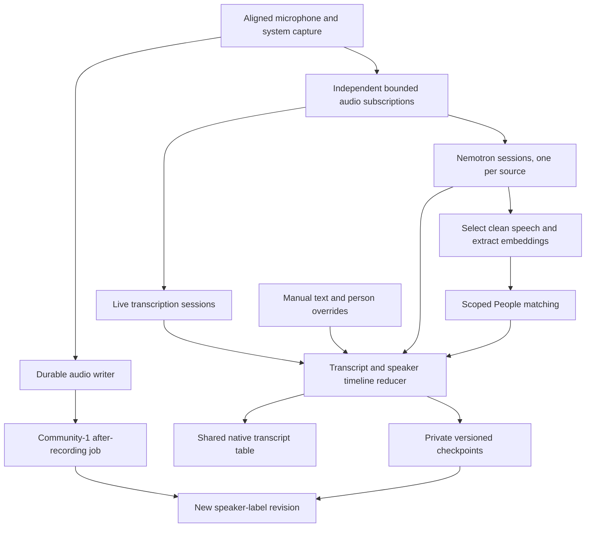
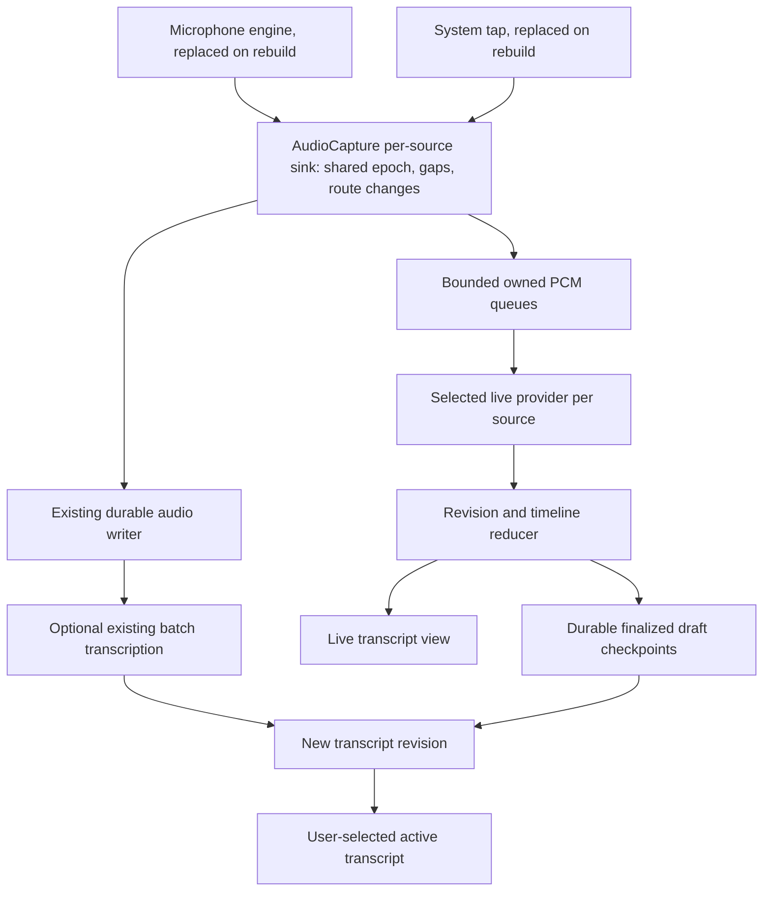

# Live Transcription and Diarization

This document combines the existing transcription research with the October 1 decisions for local speaker labels, voice matching, model downloads, and a shared live/saved transcript interface. The filename is retained so existing links continue to work. The October 1 design below takes precedence over the older phased plan where they differ.

## Current status and agreed direction — October 1, 2026

| Area | Status | Agreed direction |
| --- | --- | --- |
| Live Transcription | Apple SpeechAnalyzer integration exists | Show text as it arrives, independently of speaker processing |
| Transcript interface | Shared native table, durable live edits, and person picker implemented and regression-tested | Preserve manual edits, stable row identities, and explicit Follow Live resume |
| Live Diarization | Native Nemotron adapter and seven presets implemented; `low` remains the quality-evaluated default | Independent source sessions, versioned smoothing, bounded subscriptions, and explicit restart gaps |
| Diarization after recording | Independent Community-1 job and reversible label application implemented | Preserve transcript text and manual person assignments; retain uncertain phrase labels |
| Speaker Recognition | Typed local extraction, exact-type matching, repeated live evidence, and explicit enrollment implemented | Keep unknown legacy vectors out of automatic matching; validate false-name rates |
| Model management | Shared pinned downloads, manual-copy verification, startup preparation, and in-use leases implemented | Independent Core ML instances per lease; shared verified files; Apple assets remain system-managed |

Implementation status describes the current working tree, not a released build. The isolated release build and 569 sequential regression tests passed. Production-adapter smoke checks passed for Nemotron low and split fast32 with paced two-source audio, and Community-1 with typed extraction. Full native interaction, long-session combined resource use, and name-matching quality still need user validation; the worklogs record evidence and limits.

The providers serve different stages of a meeting. Nemotron supplies timely anonymous speaker activity; Community-1 clusters saved audio and can represent more than eight speakers. Neither identifies a person's name by itself. Speaker Recognition and manual attribution connect anonymous identities to People. Model evaluation is complete for the tested configurations, but combined transcription, diarization, and recognition performance is not yet measured.

### One transcript interface

Use `NativeTranscriptView` for both recording and saved transcripts: timestamp, speaker badge, and text in the same compact columns. Keep selection, copying, keyboard navigation, double-click text editing, and the existing person picker. Playback actions become available when the relevant saved audio is playable; they must not appear to work against an unavailable recording stream.

- Display a fallback badge such as `mic_01` or `sys_01` immediately. Do not show a separate “Microphone” subtitle. A placeholder identifies an unresolved source row, not proof that all speech on that source belongs to one person.
- Underline text that recognition can still revise. Do not display the word “Draft” on each line. Following user testing, retain the red two-word trail alongside the underline; clear both when the text finalizes or is manually edited. Provide an accessible description for the changing text.
- Double-click text to edit during recording; double-click its badge to assign a person. Opening either editor, or scrolling away, turns **Follow Live** off. Saving, cancelling, closing the picker, or waiting does not turn it back on. Only selecting **Follow Live** resumes it.
- While an editor or picker is open, retain the row identity, selection, and popover anchor. Coalesce incoming presentation updates and apply them after editing ends. Recognition and audio capture continue.
- Preserve manual text and attribution separately from recognition output. ASR finality and user authorship are different states: an explicit edit to an unfinished phrase is durable even if the recognizer never finalizes it.
- Until diarization establishes an identity, assigning a placeholder row affects that row only. Once a reliable track-scoped speaker identity exists, assigning that speaker can update its linked lines. Provide a separate line-level correction for a mistaken diarization assignment.

The earlier suggestion to display “Microphone · Unknown Speaker” is superseded by this shared-table design. Speaker labels and names must not change the transcript's layout.

### Provider capabilities and selection

| Provider or service | Capability contract | Inputs and result |
| --- | --- | --- |
| This Mac or another selected speech provider | `liveTranscription` | Timestamped source audio → provisional/final text and available word timings |
| Nemotron | `liveDiarization` | Timestamped source audio → revisable speaker activity intervals |
| Community-1 | Existing `diarization`, extended for a standalone job | Saved source audio → file-wide speaker intervals and embeddings where available |
| Compatible local embedding extractor and People matcher | `speakerRecognition` | Selected speech and scoped voice profiles → candidate person, score, and decision evidence |

Group **Settings → Defaults** into two relevant sections: **Transcription** and **Speaker Recognition**. Recording and Summaries retain their own unrelated sections. Transcription groups the live provider and display switch with the recorded-audio provider, default language, and automatic transcription preferences. Speaker Recognition groups its live and saved preferences, live and recorded-audio providers, and the shared voice-matching provider. Keep one concise explanation per section instead of separate sections and repeated setup paragraphs for each capability.

The recording-time Speaker Recognition switch enables speaker analysis, anonymous labels, and compatible voice matching together. A recognized voice displays a person's name; an unmatched voice keeps an anonymous label. The recording view uses the same single control. Stored preferences from the earlier separate labeling and matching switches remain readable: either enabled preference keeps the combined live feature enabled, and changing the combined switch updates both legacy fields. Saved-result matching remains separately configurable. Manual person assignment remains available when automatic recognition is off.

Technical provider capabilities remain independent internally, including `liveDiarization`, `diarization`, and `speakerRecognition`; the Defaults layout does not require users to manage separate live labeling and naming switches. Service Providers retains model-specific downloads and capability configuration. Turning speaker recognition off does not turn transcription off.

The current provider model lists `diarization` as an addition to transcription for server providers. Add a standalone local job contract without breaking those server adapters. Do not make a local diarizer implement text recognition merely to satisfy an inherited capability rule. Defaults, enabled capabilities, readiness checks, and per-meeting choices must distinguish live labeling from after-recording labeling. Persist the chosen model revision, preset, and processing configuration with each result.

### Model choice, speaker capacity, and latency

Nemotron's published Core ML presets share the same checkpoint and eight-channel speaker output. Arrival order is the intended channel ordering, not voice clarity. This is learned behavior, not a guaranteed register of the first eight people. With additional speakers it cannot emit a ninth independent channel; people may be merged or labels may become inconsistent. All eight active channels do not prove there are exactly eight people, and quiet speech may be missed before capacity is reached. [NVIDIA model card](https://huggingface.co/nvidia/Nemotron-3-Diarization)

The limit applies to each model session, not a count of named People in the library. Separate microphone and system sessions do not solve a meeting with more than eight voices on one track. Resetting state creates a new identity namespace and does not safely extend capacity. Show the provider's limit in Settings; do not claim that overflow can always be detected. Community-1 has configurable clustering without this fixed eight-slot output, but its count and labels can still be wrong.

| Core ML preset | Required input buffer | Product decision |
| --- | ---: | --- |
| `low` | 1.04 s | Initial live option; the configuration evaluated locally |
| `fast` | 1.04 s | Optional preset with less retained FIFO context; local quality is unmeasured |
| `fast32` | 2.88 s | Optional throughput/latency choice; compare with `low` while transcription also runs |
| `fast128` | 10.56 s | Optional delayed-label preset; unsuitable as the initial immediate-label default |
| `offline` | 30.40 s | Separate batch-shaped export; not the configuration used in our saved-file Nemotron evaluation |
| `fast32-split-w8a8` / `c128-split-w8a8` | 2.88 s / 10.56 s | Optional quantized split exports; local quality/device placement unmeasured |

These are buffer requirements, not measured latency to a correct stable speaker name. Compute, queuing, smoothing, and voice matching add delay. The Core ML exports use fixed shapes; changing a preset requires matching assets and configuration, even though the execution API is shared. Split exports also require host preprocessing and auxiliary files handled by FluidAudio. The original NVIDIA runtime documents subsecond configurations, but those are not shipped presets in the pinned Core ML snapshot. Do not expose them by changing a number in Settings. [Pinned conversion and preset documentation](https://huggingface.co/FluidInference/nemotron-3-diarization-coreml/blob/25a90f97f254428d4b30374b76af9c74fdee8327/README.md)

Support all seven published presets through the same Swift inference adapter, using the preset's matching assets and `Nemotron3Config`. Use `low` as the initial default because it was evaluated locally. The final product decision permits CPU, GPU, and Neural Engine execution; ANE-only execution is not a requirement. Device placement must not be inferred from successful execution or a low CPU percentage. The split exports' documented ANE model graphs still require CPU audio preparation and state handling.

Compare `fast32` with `low` on the same local meeting samples and under combined load. “Fast” refers to processing throughput, not necessarily earlier labels. Keep the preset fixed during a recording; selecting a new default applies to the next session. If a restart is necessary after a failure, record the gap and use a new generation rather than silently reusing slot-to-person mappings.

### Accuracy evidence and its limits

The reviewed local meeting samples contain 97 clips. The primary random subset is 66 clips from eight samples; targeted speaker-coverage and diagnostic clips are reported separately. Pooled overlap-inclusive diarization error rate (DER) is 28.45% for saved server output, 28.92% for Community-1, and 32.44% for Nemotron `low`. Excluding ±250 ms around reference boundaries gives 24.87%, 26.28%, and 30.52%. This supports offering both local models for their different operating modes, not claiming either wins every environment. [Evaluation results](../../experiments/diarization-benchmark/RESULTS.md)

Crowded meetings and quiet open-microphone speech are separate validation cases. DER weights speaker-time, so good scores on frequent speakers can conceal missed brief participants or merged identities. An eight-slot model scoring well on sampled clips does not establish that it distinguishes every participant in the complete meeting. The quiet open-microphone sample has substantial extra-speech error; its acoustic cause is not established. The references have one reviewer, and the evaluation does not measure stable live speaker recognition. Keep all reviewed audio and annotations local; no dataset upload is planned.

### Inference and environment overhead

The following results are for FluidAudio v0.17.4 on an M1 Max with 64 GiB memory, macOS 26.6.2. Full-file ranges cover five additional local meeting samples, totaling 285.60 minutes per model. They are not combined app measurements. [Resource receipts and methodology](../../experiments/diarization-benchmark/RESULTS.md#model-size-architecture-resources-and-setup)

| Measurement | Community-1 | Nemotron `low` |
| --- | --- | --- |
| Verified model payload | 21.60 MB | 199.12 MB |
| Architecture | Powerset segmentation, WeSpeaker ResNet34 embeddings, PLDA/VBx clustering | Streaming Sortformer; 100M parameters, 31-layer RoPE Transformer |
| Peak process RSS | 459.69–1,090.65 MB | 79.97–110.64 MB |
| Peak process physical footprint | 712.70–968.25 MB | 56.80–95.01 MB |
| Average process CPU | 116.45–167.42% | 7.55–8.13% |
| Total process CPU time | 102.61 s | 105.20 s |
| Total wall time including setup | 73.36 s | 1,363.32 s |
| Cached model load | 127.41–159.03 ms | 126.42–156.48 ms |

100% CPU means one core's worth of work summed across threads. For example, 116% means 1.16 core-equivalents on average; it does not describe equal use across cores. Nemotron's similar CPU seconds are spread over a much longer wall time. Both model pipelines allow Core ML `.all`; Community-1 additionally runs FBank on CPU and clustering on the host. High CPU use does not show that GPU or Neural Engine acceleration is absent. Actual device placement, GPU/Neural Engine utilization, whole-system memory, and energy were not measured. RSS and physical footprint are separate, nonadditive counters and omit some service/accelerator costs. Do not describe Nemotron as using less total compute or energy. [Core ML compute selection](https://developer.apple.com/documentation/coreml/mlcomputeunits/all)

A separate five-minute paced single-track replay measured Community-1 at 331.04 MB peak process footprint and 3.25% average CPU, versus Nemotron at 49.33 MB and 1.37%. First outputs arrived after 10.215 s and 1.206 s. Community-1 used a ten-second window-update schedule with no persistent cross-window identities; these outputs were not verified stable labels. Earlier initial Nemotron preparation took about 66–69 s. Cached loading is not first-install or cold-cache startup.

Both tested executables use native Swift, Core ML, and Apple frameworks, without Python, PyTorch, CUDA, or a local HTTP server at inference time. Building requires Swift 6.2+ and Apple build tools. FluidAudio v0.17.4 is pinned to `21493f8dac5a97e65742e6ff26f42f164c2fda0f`; the full Swift library and C/C++ helpers compile because the package has no separate diarization product. Disabling optional Rust text processing with `traits: []` prevented linking it in the tested binaries, but SwiftPM still fetched its artifact. Inspected build/development caches were about 1.06/1.17 GB; those are not shipped runtime files. Python/`uv` and FFmpeg are benchmark download/preparation tools, not requirements for inference on prepared audio. The app should consume captured PCM directly.

Model payload excludes executable code, frameworks, download overhead, and specialization caches. The tested arm64 binaries declare macOS 14; Intel and actual execution on the minimum OS remain unvalidated. Keep the app's macOS 14.2 minimum with provider availability checks. Apple SpeechAnalyzer still requires macOS 26. Simultaneous two-source transcription, two diarization states, and periodic embedding extraction require a new benchmark; neither doubling the single-stream memory figure nor adding isolated percentages predicts that workload.

The app adds timeline joins, versioned activity filtering, checkpoints, UI updates, and optional embedding extraction to these isolated workloads. Model instances are separate between leases, so concurrent jobs can add memory and preparation costs even when disk assets are shared. No end-to-end CPU, memory, energy, or correct-name latency figure has been established for that combined workload.

### Execution helpers and audio flow

The app uses native worker actors and a shared installation/lease manager. Keep model loading, inference, resampling, and clustering off the main actor and audio callback. No helper server or Python environment is needed for the selected integration. A subprocess can be reconsidered if isolation or measured library behavior warrants its lifecycle cost.

| Implemented component | Responsibility and boundary |
| --- | --- |
| Audio subscription hub | Fan out owned timestamped PCM to independent bounded consumers; preserve source, recording epoch, sequence, route generation, and gaps |
| Local model manager | Pinned manifests, downloads, verification, preparation, cache inventory, and leases preventing removal during use |
| Nemotron session actor | One state/cache per source and generation; feed 16 kHz mono buffers, drain probabilities, finalize the tail, reset explicitly |
| Community-1 job actor | Process saved sources, preserve offsets, cluster file-wide, support cancellation, and write a new result revision |
| Speaker timeline reducer | Convert activity probabilities to overlap-aware intervals with versioned engineering thresholds; reject stale generations and retain uncertainty |
| Transcript attribution reducer | Join word/phrase time ranges to intervals, preserve stable UI IDs and overrides, and publish bounded updates |
| Voice recognition worker | Select usable speech, extract scoped embeddings periodically, compare People candidates, and record matching evidence |

The live PCM hub now provides independent bounded subscriptions for transcription and diarization. Consumers do not divide one queue between them. Each subscription records its own overflow gaps; slow analysis cannot block the durable writer. Source epochs and generations survive conversion and explicit restart boundaries. Model files are shared, but each lease loads separate Core ML instances because synchronous prediction on one instance must be serialized. Within a Nemotron runtime, one actor serializes model calls while each source retains separate speaker state.

The benchmark helpers remain reproducible evaluation tools; app adapters now implement their own lifecycle:

- [Build, model download, and execution commands](../../experiments/diarization-benchmark/README.md#build-and-fetch).
- [Nemotron executable](../../experiments/diarization-benchmark/Sources/Benchmark/main.swift): load local `Nemotron3Models`, create `Nemotron3Diarizer`, feed 20 ms audio blocks, drain buffered output, and finalize. Its `.low` raw 0.5 threshold has no production smoothing.
- [Community-1 executable](../../experiments/diarization-benchmark/Sources/Community1Benchmark/main.swift): local compiled-model loading, disk-backed source preparation, and complete-file clustering. The replay adapter recomputes windows and does not maintain live identities.
- [Pinned manifest downloader](../../experiments/diarization-benchmark/download_model.py): verifies selected object sizes and hashes. The app-owned asynchronous manager implements pinned verification without requiring this script.
- [Existing People matcher](../../apps/client-macos-swift/Sources/GdayMeetings/Core/SpeakerRecognition.swift): exact-type embedding validation, per-type centroid comparison, candidate margin, and person assignment.

The app activity policy is `hysteresis-55-45-on50ms-off100ms-v1`: a slot becomes active after five 10 ms frames at or above 0.55, and inactive after ten frames below 0.45. These engineering thresholds differ from the benchmark's unsmoothed 0.5 decision. The published DER and first-output timing therefore do not establish the app's label accuracy, transition delay, or stability.

### Joining text, speaker activity, and names

Transcription and diarization have independent completion schedules. Render usable text immediately; do not await speaker labels or assume transcription always finishes first. Join results by source and audio time, never callback arrival time. Recompute only the affected timeline range when either stream revises a result.

Persist distinct identities: recording ID, source, session generation, provider speaker slot, stable application speaker ID, and optional person ID. A numbered slot from a new meeting or restarted model must never inherit a previous person's name. Keep anonymous IDs even when showing names, so a later attribution change does not rewrite the acoustic identity.

The current attribution reducer uses conservative phrase overlap and retains uncertain rows. Word-level splitting at transitions remains a future refinement; available word timing does not imply that it is implemented. Keep simultaneous-speaker evidence rather than forcing one winner, and do not invent word alignment. A manual correction anchored to a range must not expand across an ASR merge, disappear after a split, or replace unrelated words. The current edit anchors preserve manual content separately when recognition revisions cannot be reconciled safely.

Maintain separate ASR-final and speaker-stability watermarks. A final text phrase can receive a later speaker update. Store model provenance, range, revision/generation, activity or match evidence, automatic assignment, and any explicit user override. User overrides take precedence over automatic results. Coalesce UI updates without blocking ingestion or checkpointing. Stop & Save drains each consumer with a deadline and persists incomplete coverage if one fails.

After recording, Community-1 creates a new speaker-label revision against saved audio. It need not transcribe the words again. Map labels back by source/time and preserve manual text and person overrides. Surface conflicting automatic associations rather than silently transferring a person to a different voice. Retain the live result and permit restoring it through transcript history. Adoption must retain speaker records and person links; copying text while discarding those records is insufficient.

### Live voice matching

The implementation reuses People and explicitly attributed samples. Nemotron activity channels are not person embeddings. A separate actor runs the pinned Community-1 FBank/WeSpeaker models on selected speech and records the `gday-span-mask-v1` preprocessing type. Saved-audio recognition uses the same extractor rather than relabeling clustered or PLDA vectors as compatible live embeddings.

Collect enough clear, non-overlapping speech before attempting a match. The live selector requires one slot at or above 0.7 with every other slot below 0.2, at least three seconds of selected speech, and five seconds between samples for that slot. It retains bounded audio and allows only one pending extraction job. This is an activity-based selection rule, not an independently validated echo or voice-quality detector. Retain anonymous badges when evidence is insufficient and evaluate false names as well as missed matches and time to a correct name. The earlier batch threshold of 0.75 has been replaced; the current policy still needs calibration.

The current matcher uses a cosine threshold of 0.85 and a runner-up margin of 0.08. Live assignment requires three supporting candidate observations. These defaults are conservative engineering policy, not calibrated probabilities; repeated evidence does not independently establish accuracy.

Every embedding must have an explicit type identifying the embedding model that generated it. Matching must reject different types before computing similarity, even when vector dimensions are equal. A person can retain multiple samples from each of several models; adding a new model must not replace that person's other embeddings.

The implemented durable contract and remaining provenance requirements are:

| Record | Required data and invariant |
| --- | --- |
| `EmbeddingType` | Stable model identifier, immutable weights revision, and preprocessing/output compatibility version. Dimension and normalization belong to this definition; dimension alone is not a type. |
| `TypedVoiceEmbedding` | Type, vector, and extraction provenance. Validate finite values, expected dimension, and normalization before use. |
| Person voice sample | Stored on the person with meeting ID, speaker ID, typed embedding, and extraction provenance. Precise source ranges remain in the associated speaker timeline where available; the sample itself does not store an enrollment range. |
| Derived person profile | Centroid computed from that person's valid samples of exactly one type for each match request; no persistent centroid cache. |
| Recognition request | Typed query embedding. Select profiles with the identical type, then apply the current score and candidate-margin policy. Calibration remains required; no compatible profile means no automatic match. |

This is a matching invariant, not a best-effort compatibility guess. Apply it to batch and live recognition, enrollment, profile aggregation, imports, exports, and caches. A provider endpoint is provenance, not sufficient identification of its embedding model: changing model weights behind an unchanged endpoint must not retain compatibility. Persist person identity independently of the embedding type and preserve existing assignments when models change.

Swift retains the old `voiceScope`/sample `scope` and raw vectors for library compatibility; they no longer establish matching compatibility. Imported Rust profiles are marked `legacy:rust`; that marker does not identify a known model. Preserve these vectors with an explicit unknown legacy type and exclude them from automatic comparisons until their generating model can be established. Do not infer a model from vector dimensions or relabel an unknown vector as a new type. Where retained, explicitly attributed audio is available, generate an additional embedding with the selected model and keep the original. Otherwise use manual attribution or new samples. Compatibility tests must cover equal-dimension different-model vectors, mixed-model samples on one person, unknown legacy types, and model changes at an unchanged provider endpoint.

An explicit person assignment may supply an enrollment candidate only after suitable single-speaker audio and a compatible embedding exist. Do not create a voice sample from a source placeholder alone, train profiles from unconfirmed automatic matches, or let a manual line correction rename every unresolved source row. Removing or correcting an attribution must remove any associated enrollment contribution. Matching overhead includes audio selection and embedding inference and is additional to the Nemotron-only measurements.

### Provider model downloads

Model management belongs in **Settings → Service Providers**, beside model/preset selection. It is shared by Nemotron, Community-1, and the recognition extractor. Configuration identifies the desired model; readiness reflects verified local assets and runtime preparation.

| State | Display and controls |
| --- | --- |
| Missing | Model size and **Download**; selected provider also shows **Download Required** |
| Copied files found | **Verify…**; files remain unavailable for inference until verification and preparation finish |
| Downloading | Progress bar, transferred/total bytes where known, and an × button with **Cancel Download** accessibility text |
| Cancelled or failed | Concise cause and **Retry**; completed verified files are reused |
| Verifying | **Verifying…**; incomplete files cannot be loaded |
| Preparing | **Preparing…** with indeterminate progress when no truthful percentage exists |
| Ready | **Ready**, installed size, and **Remove Download** when not in use |

Downloads outlive Settings and do not block recording. The manager fetches the selected immutable manifest, verifies each temporary download, and shares verified files through a local object cache. Readiness is published only after all required hashes and Core ML preparation succeed; files can exist before readiness. Retry reuses completed verified files and restarts an interrupted file; byte-range resume is not implemented. Disk and permission errors remain actionable setup failures; free-space preflight is not implemented. A saved receipt requests fresh verification and preparation after restart, including direct runtime acquisition without opening Settings. It is never a substitute for checking the files.

Provide **Open Model Folder** and the expected folder layout so a person can download with another tool and copy model files into place when network or permissions prevent the in-app download. Refresh the inventory whenever the provider panel opens. Discovering a folder shows **Verify…**, not **Ready**. Verification uses the app's trusted pinned manifest, not claims in the copied folder, and requires no network when the complete manifest and assets are present. Report missing, incorrect, or incompatible files with a repair action. Only successful verification and model preparation enable inference.

Verifying a copied Community-1 installation also makes its identical embedding assets available through the shared cache without another download. Each installation keeps its own file links, so removing one does not remove assets used by another. A receipt that cannot be saved does not prevent using verified read-only assets in the current process; setup explains that another verification will be needed after restart.

Lease loaded assets while sessions use them; prevent removal during use and release models after work ends. The catalog currently pins one revision per model; an in-place model-update workflow is not implemented. Preparation finishing updates readiness without an app restart. Changing a preset during recording changes the next session's choice, not the running session's model/state. If a model becomes ready mid-recording and live labels are enabled, start at an explicit timestamp with a fresh generation and recorded earlier coverage gap.

Apple's system-managed speech assets remain behind an `AssetInventory` adapter. Present observable progress and supported actions without claiming app-owned files, byte counts, resumability, or removal controls that the system API does not provide. App-managed diarization downloads use immutable manifests and active-use tracking. Local inference sends no meeting audio for model installation; log asset requests separately from provider audio transmissions.

### Implementation order and acceptance evidence

| Stage | Deliverable | Required evidence |
| --- | --- | --- |
| 1. Shared transcript and editing | Native table reuse, source placeholders, durable text/person overrides, manual Follow Live resume | Synthetic light/dark and narrow/wide UI checks; edit/picker stability under ASR updates; stop/recovery/adoption tests; isolated release build |
| 2. Provider and asset foundation | Independent capabilities/defaults, model manager, standalone diarization job | Cancel/retry/resume, wrong hash, interrupted preparation, offline launch, in-use removal, and restart recovery tests |
| 3. Live speaker intervals | Independent audio subscriptions and Nemotron `low`, timeline joins and overlap handling | No capture loss or consumer starvation; two-source tests; boundaries, restarts, overflow, finalization, and more-than-eight-speaker cases |
| 4. Live names | Compatible embedding extraction, scoped People profiles, conservative recognition and enrollment | Known/unknown speakers, false matches, profile incompatibility, manual correction, voice changes, and additional resource/latency measurements |
| 5. After-recording labels | Community-1 jobs and reversible speaker-label revisions | Larger groups, quiet speech, overlap, cancellation, attribution preservation, and history restoration |
| 6. Preset and release qualification | Compare `low`/`fast32` under combined load; qualify supported devices | Paced end-to-end labels/names, 60–120 minute resource/thermal tests, CPU/GPU/Neural Engine traces, energy and total memory, clean install and supported-OS checks |

Keep the local meeting samples and evaluation results separate from synthetic repository fixtures. Test English, Mandarin, mixed speech, quiet voices, crowded rooms, short turns, and overlapping speech. Report DER, per-speaker coverage/confusion, identity churn, time to correct stable label/name, and manual-override survival. Compare single and combined workloads; first probability output is not successful attribution.

The adapters and versioned smoothing are implemented, while final integrated checks remain in progress. The benchmark DER does not score the app smoothing policy. Cross-model profile migration still needs compatible attributed audio; ambiguous phrase timing is preserved rather than forced to one speaker. Representative false-name rates, sustained combined load, device placement, energy, and the supported-device matrix remain unmeasured. A ready model badge means verified and loadable, not accurate or qualified for every workload.

## Original transcription research and implementation history

Research date: 2026-09-25, against repository baseline `9b988ca`. Architecture audit: 2026-09-26, against `169ce49`; repository facts below reflect that commit, and external provider research was not repeated. Product decisions: 2026-09-26, recorded in the Recommendation and [Live Transcription providers and controls](#live-transcription-providers-and-controls). Original scope: implementation research, primarily for the native Swift client; no feature implementation or recognition benchmark was performed during that audit. Recommendations and numerical acceptance targets below are engineering proposals, not measured results.

## Implementation status — September 26, 2026

The first native implementation is undergoing integrated validation. `This Mac` uses macOS 26 SpeechAnalyzer with separate microphone/system sessions, bounded owned PCM queues, time-indexed partial/final results, and automatic system-managed model installation. The app keeps macOS 14.2 compatibility with an unavailable explanation. No cloud live adapter or legacy recognizer fallback is added.

Finalized phrases, per-phrase locale and source, timing runs, and gaps are saved privately in each meeting’s `live-transcript.json`. Volatile text remains in memory. Batch and live-draft replacements preserve the prior editable transcript and speaker identities in `transcript-revisions.json`; the Transcript tab restores these revisions. The live draft remains separate until **Use Live Draft as Transcript** is chosen. Word highlighting and script conversion are not implemented.

The recording card includes a **Live Transcript** switch. **Settings → Defaults → Show Live Transcript** starts on; **Settings → Service Providers → This Mac** lists runtime-supported locales and model downloads. A language change restarts recognition from that point and retains finalized earlier text. Model downloads and recognition failures do not stop audio capture. A five-second finalization deadline keeps Stop & Save bounded; an incomplete draft remains recoverable.

Synthetic regression tests cover replacement, source separation, PCM ownership, queue overflow, aligned capture feeds, private persistence, and saved speaker identities. An opt-in test feeds generated English and Mandarin speech to two actual analyzers at wall-clock pace. Both languages passed. A separate authorized 90-second excerpt of a real local meeting passed both-source recognition with 17 finalized phrases in the expected timeline. These are integration checks, not a language-quality benchmark. The representative bilingual corpus, 60–120 minute load test, hardware route changes, and oldest-OS launch matrix remain release validation work. The quality targets below remain unmeasured; runtime locale availability does not qualify a language’s accuracy.

The architecture table below describes the audited pre-implementation baseline, not today’s source. See the [implementation worklog](../worklogs/2026-09-26-live-transcription.md) for current results and remaining limitations.

## Original transcription recommendation

**Good English and Chinese transcription is a minimum product requirement.** Live Transcription is a provider capability. The first build ships one provider for it: **This Mac**, built in, using Apple SpeechAnalyzer and SpeechTranscriber on macOS 26 and later. Audio stays on the Mac and there is no account or usage charge, so This Mac runs automatically. The English, Mandarin, and English–Mandarin mixed-speech gates decide which language modes This Mac serves, not whether it ships. Preserve macOS 14.2 as the app minimum and keep recording and after-meeting transcription available everywhere.

Cloud services and a self-hosted streaming server support Live Transcription only when the user configures one and selects it. They are the likely path for mixed English + Chinese if Apple's single-locale sessions fail the bilingual gate. Optional local Whisper, enabled once in Settings, adds another on-device engine later.

Live text is a durable draft. After-meeting transcription (RunPod or the Gday Meetings website) remains a separate capability for alignment and diarization; it creates a new transcript revision and does not overwrite edits. The first implementation deferred live speaker identification. The October 1 design adds independent local speaker providers and recognition without replacing that transcription contract.

Apple explicitly identifies SpeechAnalyzer as technology used by Voice Memos and Notes, and describes SpeechTranscriber as an on-device model for long-form and distant speech. This establishes a strong architectural fit, but does not prove identical application behavior or accuracy on our meeting audio. [Apple WWDC25](https://developer.apple.com/videos/play/wwdc2025/277/)

## Live Transcription providers and controls

**Live Transcription** is a capability that providers declare, like **Transcription** and **Summaries** today (`ProviderCapability` and each provider kind's supported set in [ServiceProviders.swift](../../apps/client-macos-swift/Sources/GdayMeetings/Services/ServiceProviders.swift)). Bold names and quoted messages below are proposed interface text, not released behavior.

| Provider | Where audio is processed | When it runs |
| --- | --- | --- |
| **This Mac** (built in) | On the Mac, with Apple SpeechAnalyzer and SpeechTranscriber (macOS 26+) | Automatically, unless turned off in Settings or for the current meeting |
| Local Whisper (optional) | On the Mac | After the user enables it once in Settings, which downloads the model; automatically afterwards |
| Cloud service, such as OpenAI realtime transcription or Deepgram | Audio is streamed to the service | Only when the user configures the provider and selects it for Live Transcription |
| Self-hosted streaming server | Audio is streamed to the user's server | Same as a cloud service |

### This Mac

- **Settings → Defaults → Show Live Transcript** is on by default. A **Live Transcript** switch in the recording view turns live text off for the current meeting. New Recording gets no new controls.
- Turning live text off stops recognition for that meeting, not only its display. Turning it back on resumes from that point.
- When live text can't run, the recording view states the reason and recording continues. Causes include macOS earlier than 26, an unsupported language or device, and a model that is not installed yet. Example messages: "Live transcript requires macOS 26 or later." "Preparing the English speech model…" "Live transcript isn't available for this language on this Mac."

### Model installation

Apple's speech models are system-managed shared assets installed through `AssetInventory` (API names under [Apple SpeechAnalyzer](#apple-speechanalyzer-first-provider)). The app triggers installation itself; setup never needs more than one click.

- **Automatic:** when a recording starts or a meeting's language changes and the model isn't installed, the app requests installation in the background. Recording never waits for it. Live text starts once the model is ready; audio before that point has no live text.
- **From the This Mac provider panel:** each language shows **Installed**, **Download** (a button, then progress), or **Unavailable**. These map to the `installed`, `supported`, `downloading`, and `unsupported` statuses.
- **Offline first use:** the recording view states that the model needs an internet connection to download, and recording continues. Example: "Connect to the internet to download the English speech model."
- Do not show model sizes until they are measured on an installed system.

### Configured providers

A cloud or self-hosted provider is never automatic and never a fallback. The app uses one only when the user selects it for Live Transcription. When the active provider can't serve the meeting's language mode, such as mixed English and Chinese, the recording view states the limitation instead of producing poor text. Example: "This Mac can't transcribe mixed English and Chinese live. To use another provider, select it for Live Transcription in Settings."

### Data privacy and logging

A **Settings → Data Privacy** panel is being built separately. Live transcription adds rows to it:

- **This Mac:** "Live transcription audio stays on this Mac."
- **A cloud or self-hosted live provider:** "Live transcription audio is streamed to <provider>."

Log every network transmission a live provider makes: destination, data type (such as PCM audio or a control message), and size or audio duration. Never log audio, transcript text, or credentials. These entries must appear in exported logs. Apple model downloads are performed by the system; log the installation request and its result (locale and status), not transfer sizes the app can't observe.

## What “like Voice Memos” means

Voice Memos on Mac supports transcription on Apple silicon with macOS 15+, including viewing text during recording and highlighting the current word. Availability varies by region. That application's OS requirement must not be confused with the public SpeechAnalyzer API, introduced in macOS 26. [Voice Memos guide](https://support.apple.com/en-qa/guide/voice-memos/vm4a03609f0d/mac), [SpeechTranscriber API metadata](https://developer.apple.com/tutorials/data/documentation/speech/speechtranscriber.json)

Our proposed experience:

- Start recording immediately; show in the recording view whether live text is preparing, listening, unavailable, or interrupted.
- Show stable phrases followed by visibly provisional text that can change without duplicating previous words.
- Keep notes, recording controls, and source meters accessible. Follow the newest phrase until the user scrolls away or starts editing/attribution; resume only through **Follow Live**.
- Preserve text and its timeline when recording stops. Enable transcript-to-audio navigation; add word highlighting when actual timing data exists.
- Continue recording if recognition, a model download, or a network connection fails.

Meeting capture differs from a single voice memo. Microphone and system audio are separate, time-aligned tracks, so when a local and a remote person talk at once, each voice goes to its own recognizer rather than one mixed signal. Two problems remain:

- Several remote participants share the single system-audio track and can overlap within it.
- Speaker playback can leak into the microphone. Headphones avoid this path. With **Settings → Defaults → Turn On Voice Processing Automatically** on (the default), Apple voice processing turns on for a speaker output, or when echo detection finds system audio in the microphone. Voice processing reduces leakage but does not guarantee its removal, and it can be switched off during recording.

Source separation is useful evidence, not proof of speaker identity.

## English and Chinese are release requirements

The user explicitly requires good English and Chinese support. For planning, use Mandarin as the initial Chinese speech baseline; assess Cantonese separately rather than implying that a generic “Chinese” label guarantees it. This is a scope assumption, not a confirmed exclusion of Cantonese. Include Australian English and Chinese-accented English. Treat Simplified/Traditional as an output preference distinct from the spoken language or dialect.

Proposed meeting modes are **English**, **Chinese (Mandarin)**, and **English + Chinese**. Mixed mode must preserve both languages, including English names and technical terms inside Chinese sentences; it must not translate speech into English. Keep transcription and optional translation as separate artifacts. Test utterance-to-utterance switches and switches within a sentence. “Automatic language detection” is not evidence that either case works reliably.

| Candidate | Evidence and uncertainty | Decision consequence |
| --- | --- | --- |
| Apple SpeechTranscriber / DictationTranscriber | SpeechTranscriber initialization takes one locale; query actual runtime support. A locale list does not establish mixed-language quality. | Test English and Mandarin configurations on the same bilingual fixtures. Do not promise automatic bilingual recognition from API availability alone. |
| WhisperKit / whisper.cpp | Whisper has distinct English-only and multilingual weights; quality varies by language. | Use multilingual weights, never an `.en` model for the shared default. Compare a smaller model against a large-v3-class candidate where supported; test mixed speech and thermal cost. |
| OpenAI live transcription | The current API accepts multiple expected-language hints and documents Mandarin/Cantonese and regional Chinese codes. | Evaluate `languages: ["en", "zh-cn"]` for the Mandarin trial, then validate the selected account/model accepts it. Hints do not establish accuracy or output-script guarantees. |
| Deepgram Nova-3 | Current documentation lists English, Mandarin Simplified/Traditional, and Cantonese separately; its documented `multi` language set does not include Chinese. | A candidate for explicit-language English/Chinese modes; do not qualify it for mixed English–Chinese solely because both languages appear in the overall language list. |

Sources: [Apple transcriber](https://developer.apple.com/documentation/speech/speechtranscriber), [Whisper models and language variation](https://github.com/openai/whisper), [OpenAI language hints](https://developers.openai.com/api/docs/guides/realtime-transcription), [Deepgram language matrix](https://developers.deepgram.com/docs/models-languages-overview), [Deepgram code-switching](https://developers.deepgram.com/docs/multilingual-code-switching). These document capabilities, not comparative quality on our meetings.

Do not route short audio fragments between English and Chinese engines based on a noisy language guess: switching can lose context and duplicate or omit boundary words. First evaluate a single multilingual engine per source. If an Apple language change requires a replacement session, finalize/restart at a deliberate boundary with a timestamped handoff. Running two language recognizers for each of two audio sources means four sessions and competing hypotheses; it is an experiment requiring a reconciliation policy and resource testing, not a free fallback.

### Existing language behavior that must change

Each Swift meeting stores one language code, chosen in New Recording or meeting details and initialized from **Settings → Defaults → Default Language** (initially English, `en`). The choices now come from an [app-owned standard catalog](languages.md); provider adapters resolve those choices independently, and the app rejects empty or `auto` values before upload. Each transcription attempt snapshots the meeting code and resolved provider code. One code carries both spoken language and preferred script (`zh-cn` and `zh-tw` select output conversion), and there is no list of expected languages. The worker accepts one job-level language, strips regional suffixes for WhisperX, and applies OpenCC conversion for exact `zh-cn`/`zh-tw` inputs. Its pipeline aligns each track using the transcription result's single language. These are useful batch building blocks, but neither script conversion nor that alignment path proves bilingual recognition/alignment. [Swift submission](../../apps/client-macos-swift/Sources/GdayMeetings/Core/ProviderTranscription.swift), [Language discovery](../protocols/transcription.md#discover-supported-languages), [Worker language handling](../../apps/worker-audio-extraction/src/audio_extraction/handler.py), [Worker alignment](../../apps/worker-audio-extraction/src/audio_extraction/pipeline.py)

Add separate persisted fields for expected spoken languages, optional dialect/locale, preferred script, and the provider's actual configuration. Map these through each adapter rather than passing one provider's language codes unchanged everywhere; a live engine's supported locales are not the batch provider's catalog. Preserve raw recognized text alongside any display conversion. Conversion can alter character counts and phrases, so retain explicit mappings for timing/edit offsets; do not attach old character offsets blindly to converted text. For mixed-language batch alignment, evaluate per-span alignment or preserve coarser trustworthy timing when an aligner cannot represent a span. Missing alignment must not delete correctly recognized text.

### What “good” must demonstrate

Use independently reviewed reference transcripts from English-only, Mandarin-only, and mixed meetings, including names, dates, amounts, acronyms, Chinese punctuation, regional accents, remote-call compression, and overlaps. Keep a separate Cantonese set and report its status honestly. Suggested initial quality targets on clear meeting audio are English WER ≤ 10%, Mandarin CER ≤ 10%, and mixed error rate ≤ 15%, with ≥ 95% exact accuracy on annotated important names/numbers. These are proposed acceptance thresholds, not measured capabilities; review their suitability after the corpus baseline rather than weakening them implicitly to fit a provider.

For mixed error rate, specify tokenization as individual Han characters plus English word tokens, and publish normalization rules. Report raw and script-normalized Chinese CER so character conversion does not conceal recognition errors. Score language slices separately, along with omitted spans, unintended translation, and latency around switch points. An overall average must not conceal poor Chinese results behind a larger English sample. Use the same recording and latency gates for all three primary modes.

This Mac serves a language mode only after that mode's slices pass. If Apple passes monolingual modes but fails mixed speech, This Mac states the limitation for mixed mode; mixed mode then needs enabled local Whisper that passes, or a configured provider the user selects. If none passes, label the limitation and keep recording available; post-meeting repair does not satisfy the live bilingual requirement.

## Existing integration points

Findings are from source inspection at `169ce49`, not from running the app.

| Area | Current behavior | Implication |
| --- | --- | --- |
| [Package.swift](../../apps/client-macos-swift/Package.swift) | macOS 14.2 minimum; Swift tools 5.9 manifest; native audio bridges | Gate modern Speech types behind availability checks; update build-tool documentation when adopting a newer SDK |
| [AudioCapture.swift](../../apps/client-macos-swift/Sources/GdayMeetings/Core/AudioCapture.swift) | Owns both track writers, one host-clock epoch for the whole recording, and a recovery controller per source. Rebuilds the microphone engine or system tap after route, format, or device changes, a missing timestamp, or 3 seconds without buffers; the other source keeps recording. Each microphone build pins a selected microphone and applies the voice-processing policy (automatic, live switch, or echo-triggered). Records each route change. `onFailure` fires only for writer errors or when every selected source has failed. | Put the recognition fan-out here, in a per-source sink that outlives capture sessions: each session's tap closure is discarded on rebuild. Forward reconnect, format, and voice-processing changes as discontinuity events. ASR errors must not reach `onFailure`. |
| [CaptureSourceRecovery.swift](../../apps/client-macos-swift/Sources/GdayMeetings/Core/CaptureSourceRecovery.swift) | Running, reconnecting, failed, and stopped states per source; a generation per rebuild request; debounce and capped backoff; stop with a deadline that abandons a stuck native call | A capture generation identifies a device session, not a recognition session. A rebuild should add a discontinuity, not end live text. Do not make ASR finalization wait on an abandoned attempt. |
| [SystemAudioCapture.swift](../../apps/client-macos-swift/Sources/GdayMeetings/Core/SystemAudioCapture.swift) | Core Audio process tap, C ring buffer, consumer queue; one reusable stereo Float32 buffer. One instance per tap session: format, aggregate, or ring failures report an interruption and recovery replaces the instance. | Keep inference and allocations out of the IOProc; copy before the consumer reuses its buffer. The sample rate can differ after a rebuild. |
| [TimedAudioWriter.swift](../../apps/client-macos-swift/Sources/GdayMeetings/Core/TimedAudioWriter.swift) | Fixes each track's format at its first device; maps channels and resamples later formats into it. Maps host time to frames, pads missing intervals with silence, trims overlaps, and records gaps of 0.1 seconds or longer. | Its converted output has one format and the saved file's frame positions, which makes it the simplest recognition input. It is not exposed today. A hook would run under the writer lock on capture threads, so it must copy into a bounded queue without blocking. |
| [EchoDetector.swift](../../apps/client-macos-swift/Sources/GdayMeetings/Core/EchoDetector.swift) | Correlates 20 ms level envelopes of microphone and system audio over 6 seconds at 0–400 ms lags, once per second. Runs only while both sources record and the microphone is unprocessed. Under the automatic policy, a report turns voice processing on; only the live switch turns it off again. | Makes leakage less likely to reach the microphone recognizer, without guaranteeing it. It stops evaluating once processing is on, so it does not measure residual echo. |
| [RecordingAudioRoute.swift](../../apps/client-macos-swift/Sources/GdayMeetings/Core/RecordingAudioRoute.swift) | Classifies the default output's terminal type: speakers turn automatic voice processing on; headphones and unknown routes leave it off. Lists input devices for the Microphone menu. | Describes the Mac's default output, not a calling app's own output choice. Expected leakage in a given recording remains uncertain. |
| [MeetingStore.swift](../../apps/client-macos-swift/Sources/GdayMeetings/Core/MeetingStore.swift) | Owns the recording lifecycle and saves the recording profile, including gaps and route changes, at start and stop. After a successful stop, transcribes only when **Automatically Transcribe Recordings** is on (off by default). `isBusy` and `statusMessage` drive a progress bar that is hidden while recording; failures appear as alerts through `errorMessage`. | Add a separate live-session lifecycle and finalization state. Do not use `isBusy` or `statusMessage` for live text: `isBusy` disables other actions and the bar is hidden during recording. Use alerts only for failures that need action. |
| [MeetingIntelligence.swift](../../apps/client-macos-swift/Sources/GdayMeetings/Core/MeetingIntelligence.swift) | Resolves the meeting's transcription provider (RunPod with Filedrop, or the Gday Meetings website) and the summary provider. The OpenAI-compatible provider handles summaries only. | Add a Live Transcription capability to `ProviderCapability` with its own streaming contract; This Mac is its first provider. No current provider streams. |
| [ProviderTranscription.swift](../../apps/client-macos-swift/Sources/GdayMeetings/Core/ProviderTranscription.swift) | Durable provider/upload/job checkpoints; language snapshot validated against the provider's catalog; per-track microphone/system source type; preserves transcript edits and retains conflicting results | Retain retry semantics; extend revision handling before combining with live drafts |
| [Models.swift](../../apps/client-macos-swift/Sources/GdayMeetings/Core/Models.swift) | Segment ID, start/end, speaker, text; one language code per meeting; no word timing, revisions, or finality | Extend storage deliberately rather than treating each partial as a new segment |
| [RecordingWorkspaceView.swift](../../apps/client-macos-swift/Sources/GdayMeetings/UI/RecordingWorkspaceView.swift) | New Recording setup (title, language, sources, Microphone menu) and the live view: reconnect status, source meters, and the **Voice Processing** switch with its notices | Add live text and the **Live Transcript** switch to the live view only, with synthetic preview events; keep recognition state separate from capture reconnect status |
| [Worker](../../apps/worker-audio-extraction/README.md) | File jobs; WhisperX/faster-whisper, alignment, pyannote diarization | Suitable for post-processing; no current continuous-audio transport |

The current Swift system capture uses Core Audio taps, not ScreenCaptureKit. Replacing capture is unnecessary for this feature. The Rust client can later reuse the event/storage contract, but needs its own provider integration; Swift framework integration is not automatically portable.

## Approaches considered

Relative effort includes packaging, lifecycle, and recovery, not just calling an inference API.

| Approach | Compatibility and execution | Main benefit | Main cost or limitation | Decision |
| --- | --- | --- | --- | --- |
| SpeechAnalyzer + SpeechTranscriber | macOS 26+; runtime device/locale checks; on-device | Native streaming and system-managed assets | Newer OS; must test two simultaneous sources and bilingual quality | This Mac provider; first build |
| DictationTranscriber | macOS 26+; older dictation models on-device | Additional hardware/locale coverage within the new API | Different quality profile; does not backport to macOS 14/15 | Evaluate as a This Mac fallback |
| SFSpeechRecognizer | Available on our older OS baseline; local capability varies | Small native prototype | Short-session guidance, authorization, possible server dependence | Avoid as the primary meeting engine |
| WhisperKit | Swift/Core ML; Apple-silicon focus | Offline model choice and older-OS coverage | Model acquisition, warmup, resource tuning, evolving package | Optional local Whisper, enabled once in Settings |
| whisper.cpp | C/C++; CPU and accelerated backends | Broad portability, including a potential shared Rust backend | Native build/bindings and streaming policy ownership | Consider if Intel/cross-platform becomes a priority |
| Hosted streaming ASR | Audio leaves the device; network required | Low local compute; provider-specific language/timing features | Usage charges, credentials, reconnects, service limits | Configured provider; used only when selected |
| Self-hosted streaming ASR | New persistent streaming service | Infrastructure/data control | Scheduling, warm models, transport, capacity and operations | Configured provider; later if justified by deployment needs |
| Repeated short file jobs | Reuses much of current batch pipeline | Quick demonstration | Boundary errors, repeated compute, queue latency | Prototype only |

### Apple SpeechAnalyzer: first provider

Use `SpeechTranscriber.isAvailable` and `supportedLocale(equivalentTo:)`; do not assume that OS version, CPU architecture, or a manually constructed locale string guarantees support. `DictationTranscriber` uses on-device dictation models and does not provide locales that the older recognizer supports only over a network. Both modern transcribers require macOS 26. [SpeechTranscriber](https://developer.apple.com/documentation/speech/speechtranscriber), [DictationTranscriber](https://developer.apple.com/documentation/speech/dictationtranscriber)

Model readiness is a product state. `AssetInventory` manages shared, system-managed downloads and a bounded set of locale reservations. `status(forModules:)` returns `unsupported`, `supported` (downloadable), `downloading`, or `installed`. `assetInstallationRequest(supporting:)` returns an optional `AssetInstallationRequest`, whose `downloadAndInstall()` installs the assets and whose `progress` drives the panel's progress display. `reserve(locale:)`, `release(reservedLocale:)`, `reservedLocales`, and `maximumReservedLocales` manage reservations. Handle unavailable storage, cancellation, offline first use, and previously removed assets. Release obsolete locale reservations when preferences change, rather than repeatedly churning them per audio buffer. These names were checked against the macOS 27 SDK's Speech module interface. [AssetInventory](https://developer.apple.com/documentation/speech/assetinventory)

The analyzer accepts asynchronous PCM input; transcription results arrive separately. Choose a compatible format with `bestAvailableAudioFormat`, convert with a persistent converter, and finish analysis explicitly. Ending an input stream alone does not generally finish the analyzer. One analyzer consumes one input sequence; simultaneous analysis is resource-limited. [SpeechAnalyzer](https://developer.apple.com/documentation/speech/speechanalyzer)

Enable volatile results and audio time-range attributes, or the corresponding time-indexed progressive preset. Results can revise a phrase before it becomes final. Preserve attributed timing runs alongside plain text; a display word is not necessarily identical to an attributed-string run. [Result](https://developer.apple.com/documentation/speech/speechtranscriber/result), [Apple sample](https://developer.apple.com/documentation/speech/bringing-advanced-speech-to-text-capabilities-to-your-app)

Proposed integration sequence:

1. At recording start, check locale support and model status. If the model is missing, request installation in the background and start the session once it is installed. Recording never waits for this step.
2. Create one provider session per enabled source, beginning with a one-source spike, then verify two analyzers under load. Do not override resource limits to force the feature on.
3. Copy buffers into bounded owned storage. On a worker task, convert to the analyzer format and assign input times from the recording epoch.
4. Consume provider results into the reducer described below. UI work runs on the main actor; inference does not.
5. Stop capture, drain queued audio, finish the input sequence, call `finalizeAndFinishThroughEndOfInput()`, await result completion, and checkpoint. Apply a timeout; retain incomplete status if finalization fails.

Build with an SDK containing these symbols, use `@available(macOS 26.0, *)` and guarded construction, and launch-test the same binary on macOS 14.2/15. A runtime availability check cannot make an old SDK compile unknown types. The installed Speech module interface confirms the above symbols; newer documentation also describes helper APIs, so verify each helper's own introduction version before using it in the macOS 26 path.

### Older Apple recognizer: a constrained fallback

`SFSpeechAudioBufferRecognitionRequest` can consume PCM and report partials. Apple still documents planning for roughly one-minute recognition tasks and service throttling; locale support may require a network. This is poor default behavior for an hour-long meeting. The currently fetched class metadata does **not** mark SFSpeechRecognizer deprecated: it is a legacy design tradeoff, not an asserted compiler deprecation. [SFSpeechRecognizer](https://developer.apple.com/documentation/speech/sfspeechrecognizer)

If deliberately implemented, check on-device support, require local recognition for an offline setting, and never silently switch to remote processing. Use the speech authorization flow and appropriate purpose string in addition to existing capture permissions. Rolling requests would need overlap, timestamp rebasing, deduplication, cancellation, and recovery tests; observed longer local sessions are not a replacement for a supported duration contract. [On-device requirement](https://developer.apple.com/documentation/speech/sfspeechrecognitionrequest/requiresondevicerecognition), [Speech purpose string](https://developer.apple.com/documentation/bundleresources/information-property-list/nsspeechrecognitionusagedescription)

### Local Whisper: control in exchange for model ownership

WhisperKit now lives in Argmax's `argmax-oss-swift` repository. Its open-source CLI documents microphone streaming, while its HTTP file endpoint and commercial Pro streaming products are separate capabilities. Do not assume a Pro demonstration describes the open-source implementation. The inspected package manifest declares macOS 13 and Swift tools 5.10; pin a release and verify its actual product requirements before integration. [Project](https://github.com/argmaxinc/argmax-oss-swift), [Manifest](https://github.com/argmaxinc/argmax-oss-swift/blob/main/Package.swift), [Pro streaming documentation](https://app.argmaxinc.com/docs/examples/real-time-transcription)

For our client, inject captured samples instead of starting the library's microphone recorder. Budget download size, cache integrity, compilation/warmup, memory, battery, and two-source throughput. Persist the chosen model/version for reproducibility. Prefer an optional download over bundling large weights into every installation. Benchmark small and larger multilingual models on our own corpus before selecting one.

whisper.cpp provides native inference and CPU/Metal support, but its microphone stream example is a simple periodically evaluated window. It is a useful starting point, not a finished meeting transcript lifecycle. [whisper.cpp](https://github.com/ggml-org/whisper.cpp), [Stream example](https://github.com/ggml-org/whisper.cpp/blob/master/examples/stream/README.md)

For either backend, repeated windows need a stability policy: align overlapping hypotheses, commit their agreed prefix, and keep the tail revisable. Limit contextual history and trim confirmed audio so memory and repeated inference do not grow with meeting length. VAD can reduce silence work, but should not clip quiet speech. The Whisper-Streaming authors demonstrate local agreement and now direct users to SimulStreaming; their published latency is benchmark-specific, not a Gday guarantee. [Whisper-Streaming](https://github.com/ufal/whisper_streaming), [SimulStreaming](https://github.com/ufal/SimulStreaming)

### Hosted streaming: useful, but a new provider contract

OpenAI's current guide recommends a transcription session with `gpt-live-transcribe`, incremental/completed events, and application commits. Its documented PCM example uses 24 kHz. That model uses client-side turn detection rather than `server_vad`/`semantic_vad`; completion events across turns are not guaranteed to arrive in order. It does not provide word timestamps or diarization. Track item IDs and application audio ranges. Recheck these model-specific details before implementation instead of copying older Realtime examples. [Realtime transcription](https://developers.openai.com/api/docs/guides/realtime-transcription)

Deepgram offers interim text plus distinct segment-final and speech-end indicators. These represent different boundaries and should map separately into our provider events. Its multichannel API can transcribe channels independently; construct correctly synchronized source channels rather than assuming a stereo system mix already means two speakers. [Endpointing](https://developers.deepgram.com/docs/understand-endpointing-interim-results), [Multichannel](https://developers.deepgram.com/docs/multichannel)

Proposed cloud design: start with one adapter, used only when the user selects it for Live Transcription. Add its Data Privacy row and transmission logging (see [Data privacy and logging](#data-privacy-and-logging)). Use either a user's Keychain-held credential or a server-brokered short-lived credential. Never embed an application-wide secret in the app. The server must check meeting ownership and usage limits before brokering or proxying. Use bounded reconnect/backoff, sequence numbers, a confirmed-audio watermark, and gap markers. Replaying uncertain audio can duplicate billing and results; reconcile by source/session/time rather than text alone. Provider retention and residency settings must be checked for the chosen account before describing this mode as private.

The app's OpenAI-compatible provider handles summaries only. File transcription with a streamed response and ongoing audio ingestion are different protocols; a file endpoint is not a streaming foundation. [File transcription guide](https://developers.openai.com/api/docs/guides/speech-to-text)

### Self-hosted streaming and repeated file chunks

Our worker accepts complete file jobs and serializes local inference. Adding a WebSocket route alone would leave model scheduling, incremental state, fairness, cancellation, and result durability unsolved. A streaming service should keep models warm, authenticate per meeting, bound each session, and publish typed events through the server. Keep final alignment/diarization in a separate queue so they cannot stall active meetings. SimulStreaming is a candidate to evaluate, not a drop-in replacement for the worker's WhisperX contract.

Short overlapping uploads are acceptable for a disposable experiment. For a window of length W submitted every S seconds, repeated audio approaches W/S times the original duration: a 10-second window every 2 seconds is approximately five times the audio work before retries. That can multiply provider charges and local compute. Non-overlapping chunks avoid that multiplier but lose boundary context; neither solves partial-result reconciliation automatically.

## Proposed architecture and data contract

This is a proposed boundary, not a new dependency requirement. A provider exposes readiness, supported locales, timing granularity, incremental capability, and local/remote execution. It accepts audio envelopes containing recording ID, source ID, sequence, format, first-frame time, and owned PCM; it emits replacement/finalization events, recoverable gaps, or failures.

Use a session generation to reject results from a previous recording or restarted provider. An event should identify its source/session, provider item or range, revision, text, finality, and available timings. Normalize provider-specific semantics inside adapters. Replacement updates must not append repeated hypotheses. A final phrase from one source must not clear the other source's provisional text.

Timing rules:

- Express persisted times relative to the capture epoch, not callback arrival time or `Date()`. One epoch covers the whole recording, including source rebuilds.
- Keep source offsets through resampling. Account for conversion buffering; do not reset sample counts per callback. A rebuilt source can arrive in a new sample rate or channel count; start fresh converter state at that boundary. Feeding the writer's converted output avoids this, since the track format is fixed (see the table above).
- Match the writer's decisions: it pads missing intervals with silence, trims overlapping frames, and records gaps of 0.1 seconds or longer in the track's `gaps`. Send explicit discontinuities for those intervals instead of recognizing padded silence as audio. Never concatenate separated audio and then pretend it was continuous.
- Treat each route change (device, format, voice processing, with a reason) as a possible recognition discontinuity. `RecordingProfile.routeChanges` persists them, but the meeting saves the profile only at start and stop, so a live consumer needs AudioCapture events.
- Sort across sources by audio time with deterministic tie-breaking. Recognition completion order is not conversation order.
- Store word timing only when supported. Application turn boundaries are coarse estimates, not word alignment.

Backpressure is a correctness issue. Start with a bounded queue sized in seconds and profile it; do not use an unbounded AsyncStream or create a Task for every buffer. On saturation, preserve recording, mark the skipped recognition interval, and offer later repair from saved audio. Do not invoke AudioCapture's recording-failure callback for an ASR-only failure. ASR startup should not hold the recording controls hostage to a download.

For two-source capture, prefer independent recognition when resources permit; use `mic_01` and `sys_01` fallback badges in the shared transcript table. These identify unresolved source rows until diarization supplies identities. A single mixed ASR stream is a possible lower-resource mode but loses source attribution and puts simultaneous local and remote speech back into one signal. Do not silently downshift.

Leaked speaker audio can make the microphone recognizer repeat remote speech. Automatic voice processing makes this less likely, but does not prevent it: the automatic setting or the live switch can be off, unknown routes start unprocessed, echo detection needs speech-like system audio, and residual echo with processing on is unmeasured. Test with headphones, and with speakers with processing on and off. Avoid removing repeated phrases solely because their text matches. Untested idea: the echo detector's envelope correlation and lag could provide acoustic evidence that a microphone span repeats system audio before text is de-duplicated.

Persist finalized live phrases in a versioned per-meeting journal/checkpoint, with source, engine/model/locale, coverage, and completion status. Keep unedited volatile recognition text in memory; explicit user edits and attribution anchors must be durable separately. Atomically checkpoint and bound journal growth; on recovery, retain confirmed text and identify unprocessed audio ranges. Store user edits separately from provider revisions or create immutable transcript revisions with an active revision pointer. Backward-compatible decoding and export behavior need tests.

The original audit found batch completion replacing `meeting.transcript` wholesale; transcript revision preservation has since been implemented. Extend that preservation to separate speaker-label results and explicit live overrides. A provider's “final” means stable within that recognition session, not a verified meeting record. Summaries/search should use the selected stable revision and should not be regenerated on every partial token.

## Original transcription delivery plan and decision gates

The first build is stages 1–3 and ships This Mac as the only Live Transcription provider.

| Stage | Deliverable | Exit evidence |
| --- | --- | --- |
| 1. This Mac spike | Live Transcription capability, automatic model installation, one PCM source, provisional/final reducer, timestamp export | English, Mandarin, and mixed-speech quality/latency results that decide which modes This Mac serves; offline after installation; final words preserved at stop |
| 2. Capture integration | Per-source fan-out in AudioCapture, two sessions, bounded queues, discontinuities for source rebuilds | 60–120 minute capture without ASR-induced recording loss; live text continues through route changes and Voice Processing switches; synchronization and resource measurements |
| 3. Product behavior | Live workspace and **Live Transcript** switch, **Show Live Transcript** setting, This Mac provider panel with per-language model status, unavailable and preparing states, Data Privacy row, checkpoints, recovery, transcript revision policy, macOS 14.2/15 feature gating | Crash/stop/error scenarios, user edits preserved, recording unaffected by missing or downloading models, synthetic UI Preview validated, actual oldest-OS launch and architecture matrix |
| 4. More on-device coverage | DictationTranscriber evaluation; optional local Whisper, enabled once in Settings | Same quality gates per language mode; no audio leaves the Mac |
| 5. Configured live providers | One cloud adapter or a separately justified self-hosted service, with Data Privacy rows and transmission logs | Account capability, measured latency/cost, reconnect/duplicate tests, logs contain no audio or text |

Planning estimate for one maintainer: 2–4 days for the Apple spike, then roughly 1–2 weeks for capture/lifecycle/storage/UI hardening, with stages 4 and 5 adding further work. These are rough engineering estimates; re-estimate after the two-source and stop/finalization experiments.

Routing:

1. Use the provider selected for Live Transcription in Settings. This Mac is the default.
2. Use a cloud or self-hosted provider only when the user selects it; never fall back to one automatically.
3. On the Mac, use an engine that passes the gates for the meeting's language mode: SpeechTranscriber, or local Whisper once the user enables it.
4. With none qualified, the recording view states the limitation; recording and after-meeting transcription remain available.

## Evaluation and operating costs

Create a consented, manually checked evaluation corpus containing Australian English, Mandarin, English–Mandarin mixed speech, accents, names/numbers, quiet and noisy rooms, remote compressed audio, overlapping speakers, speaker playback with voice processing on and off, and silence/music. Chinese and mixed-language cases are mandatory evaluation slices. Run the same timestamped PCM through providers at wall-clock pace; faster-than-realtime file tests cannot establish live latency.

Suggested initial targets, subject to the spike:

| Metric | How to measure | Proposed gate |
| --- | --- | --- |
| First useful partial | Audio word/phrase time to visible text, warmed model | p95 ≤ 2 seconds |
| Stable phrase latency | End of utterance to final result | p95 ≤ 5 seconds |
| Capture integrity | Compare captured frame/gap counters with ASR off/on | No additional unexplained audio loss |
| Sustained throughput | Queue age plus inference time / audio duration | Bounded queue over 60–120 minutes; no accumulating delay |
| Text accuracy | Separate English WER, Mandarin CER, mixed error rate, and named-entity errors | Apply the proposed bilingual thresholds above to human references; compare existing batch output as a baseline |
| Timeline | Known audible markers and transcript seek checks | Segment offsets within 250 ms on controlled fixtures; evaluate word times separately |
| Resource use | App and speech-service CPU/memory, energy, thermal state | Bounded growth and usable concurrent meeting app |
| Recovery | Provider death, network loss, disk failure, sleep, source rebuild after a route change or Voice Processing switch, app restart | Audio preserved where capture succeeds; gaps visible; no duplicated finals or lost edits |

Also test denied microphone/system permission, first-run download cancellation, unsupported locale, model eviction, provider quota errors, rapid Start/Stop, stopping mid-word, and one source remaining silent. Capture continues through route changes, replacing a source's engine or tap and padding the gap. Live transcription must continue too: accept a new format, a gap, a voice-processing change, and a new capture generation for either source without ending the live session, and finalize once at **Stop & Save**. A recording ends early only on a writer error or when every selected source has failed.

Apple avoids a separately contracted metered ASR service, but local inference still consumes device resources and model storage. Whisper variants add model delivery/support overhead. Cloud costs depend on actual billable audio/channels, retries, model, account plan, and any final batch pass; do not budget only wall-clock meeting duration. At a hypothetical rate r per audio minute, a 60-minute meeting sent as two continuously billed streams costs 120r before retry/post-processing costs. This is a formula, not a provider quote. Capture actual usage from a pilot before choosing a paid default. Self-hosting must include idle warm capacity and operational time, not just inference seconds.

## Open questions and limits of this research

- The September 25 research audit ran no recognition. Subsequent Apple integration checks and local diarization evaluation are summarized above; they do not establish representative bilingual accuracy, sustained combined-session capacity, battery impact, or echo-related duplicate text.
- Supported locales and device readiness must be queried at runtime; documentation language lists are not recognition-language lists.
- Verify permissions for the selected modern Speech path in the packaged app. Existing microphone/system purpose strings are present; an SFSpeechRecognizer adapter would require its own speech authorization setup. Do not add unrelated screen-capture permissions.
- Check the chosen release's SDK availability and compiler diagnostics during implementation. This document does not certify a warning-free application; current build results and retained dependency/toolchain warnings belong in the implementation worklogs.
- The original segment schema lacked timing and revision storage. Live timing runs, transcript revisions, speaker timelines, typed embeddings, and manual overrides are now implemented. Their current validation evidence is separate from representative language, identity, and sustained-load qualification.
- The most consequential first experiment is two-source, long-duration Apple recognition on the lowest supported device for that mode. If it fails the latency/resource gate, prefer an explicit one-source mode or another provider instead of weakening recording reliability.
- Whether Apple's single-locale sessions pass the mixed English + Chinese gate is unknown. The answer decides whether mixed mode needs a configured provider.
- Apple speech model sizes are unmeasured; measure them before showing sizes or storage warnings.
- Locale reservations are bounded by `maximumReservedLocales`. Define which locales to reserve and release when a meeting's language changes or a language is downloaded from the This Mac panel.
- Decide whether local Whisper appears as its own provider or as an option of This Mac, and which engine wins when both SpeechTranscriber and Whisper pass for a mode.
- Align Data Privacy row wording and the transmission log format with the separately built Data Privacy panel.
