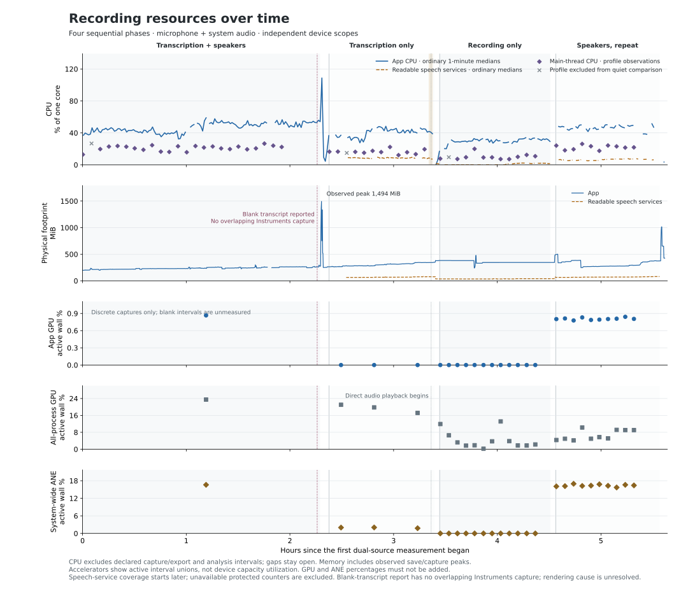
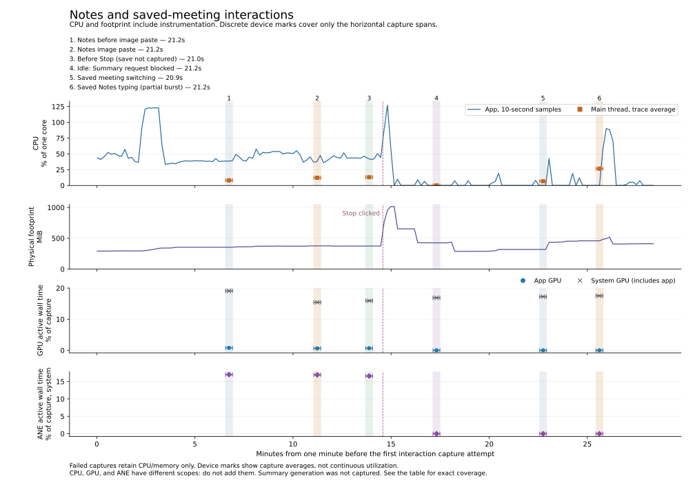
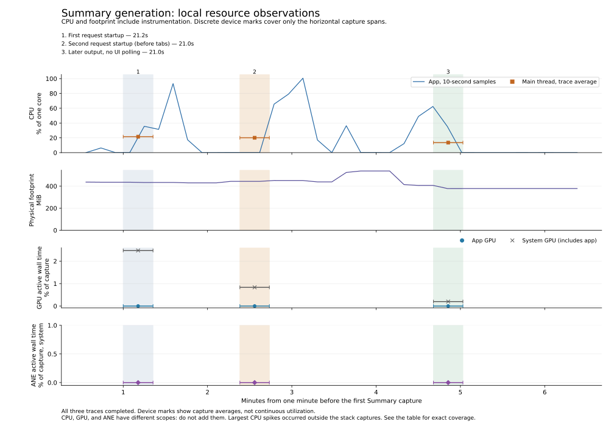

# Recording resources over time

- **Ordinary app CPU was about 47% with speakers, 41% with transcription only, and 30% recording only.** These sequential runs have different source material and caches; they are not controlled feature-cost estimates.
- **Rendering remains the main unresolved issue.** The user saw a brief blank transcript after returning from another app. Nearby CPU samples show no large spike, but no Instruments trace overlaps the event. Quiet main-thread CPU is lower with fewer live processing features; that does not establish frame or input latency.
- **Saving differed sharply between runs.** The first speaker-enabled save reached **1,494 MiB** of physical footprint. Transcription-only reached **382 MiB**, recording-only stayed near **345 MiB**, and the repeated speaker-enabled save reached about **1,015 MiB**. Only the recording-only trace captured finalization; the final repeat’s intended save trace ended before Stop was clicked.
- **Accelerator work changes with processing mode.** The initial speaker-enabled probe recorded Nemotron GPU work and 16.6% Neural Engine active wall time. Transcription-only probes recorded no app GPU work and 1.8–2.0% Neural Engine activity. All twelve recording-only probes recorded neither. Ten regular probes in the final repeat recorded 0.78–0.84% app GPU and 15.7–17.0% system Neural Engine active wall time. The last two regular probes were skipped while manual workloads held the capture lock.

CPU uses one core as 100%. Memory means physical footprint, not RSS. GPU and Neural Engine points show active wall time within short captures, not device-capacity utilization or energy. Their scopes differ and their percentages must not be added.

## Progress

| Part | Processing | Saved duration / measured interval | Status |
| --- | --- | --- | --- |
| 1 | Transcription, speaker labeling, and association | Audio 2:18:55.929; first 120 monitored minutes compared separately | Complete |
| 2 | Transcription only | Audio 1:02:37.678; first 60 monitored minutes compared separately | Complete |
| 3 | Recording only | Audio 1:04:31.214; first 60 monitored minutes compared separately | Complete; 12 combined device captures |
| 4 | Transcription, speaker labeling, and association again | Audio 1:01:24.524; first 60 monitored minutes compared separately | Complete; 10 regular combined captures, with two scheduled gaps |

All recordings use microphone and system audio, voice processing, Opus, and the same installed release. The user confirmed that journal growth was fixed separately; it is not an open finding here, and the app was deliberately not upgraded during this comparison.

## Rendering and saving

The blank-transcript screenshot is approximately **11:43:17 UTC / 21:43:17 local on October 2**. Surrounding ten-second app CPU samples were **56.5%** and **50.4%**; that minute ranged from 48.8% to 62.5%. A later sample reached 73.9% at 11:44:14, but timing alone cannot link it to the blank view. Switching to another meeting and back rendered quickly. The foregrounding failure was not reproduced.

The last first-phase Instruments trace completed at 11:23:10 UTC. Scheduled traces stopped at the planned two-hour cutoff while ordinary resource samples continued. No stack, frame, hang, or redraw trace covers the blank state. Ten-second CPU averages can hide a brief main-thread stall; low average CPU does not rule out drawing or invalidation failure.

In the first phase, compared early and late quiet windows had mean main-thread CPU of **20.9% and 22.2%**. Layout accounted for about half of main-thread samples; stream refresh about 1.5–2.0%. These inclusive categories overlap. They identify layout as a useful investigation target without proving that old transcript rows are re-rendered or that recording age caused the total CPU increase.

| Save | Sampled app CPU peak near save | Physical footprint before → observed peak | Trace coverage |
| --- | ---: | ---: | --- |
| First speaker-enabled run | 146.6% | ~277 → 1,493.7 MiB | Started after the largest spike; cause unresolved |
| Transcription only | 58.9% | ~349 → 382.2 MiB | Ended about eight seconds before audio finalization |
| Recording only | ~30%, then ~4% after stop | ~345 → ~345 MiB | 120.9-second trace spans finalization |
| Repeated speaker-enabled run | 127.1% | ~375 → ~1,015 MiB | Intended save trace ended at 15:01:36; Stop was clicked at 15:02:07.669 |

These sampled peaks are lower bounds on instantaneous peaks. The recording-only trace includes idle time and accessibility work after saving, so its whole-trace CPU average is not a save-only cost. A transient **478.4 MiB** recording-only footprint peak occurred around a scheduled capture, then fell to 331.4 MiB ten seconds later. It was not sustained; its allocation cause remains unknown.

The repeated speaker-enabled hour had ordinary app CPU median **47.0%** (p95 **51.6%**, 197 samples), readable speech-service median **6.5%**, and main-thread trace median **22.5%**. Layout represented 48.8% of sampled main-thread CPU. Its footprint fell from a startup high around 495 MiB to about 268 MiB, remained around 269–279 MiB during minutes 20–40, then rose during Notes and instrumentation workloads. That is not evidence of a steady leak.

## Notes and navigation workloads

Notes testing added 40 synthetic paragraphs and four image attachments: two images pasted twice. A later saved-Notes workload added six more typing bursts, about 815 characters each. Forty typing calls took about 60 seconds. The first 90-second all-device capture exceeded the artifact cap while finalizing and could not be recovered. Its CPU/memory samples remain, but there are no usable stack or accelerator measurements for rapid typing.

The first image paste fell after its capture ended. A repeated paste at 14:58:52.041 was covered by the 14:58:36.622–57.774 trace: app/main CPU averaged **42.1% / 12.3%** of one core. Sampled Notes image handling was 11 ms and paste handling 3 ms; layout was 700 ms and accessibility work 318 ms. Inclusive categories overlap and do not measure input latency. These observations do not reproduce a sustained Notes rendering freeze.

The later saved-Notes typing trace ran 15:12:59.380–15:13:20.560, covering only the first 7.28 seconds of the 15:13:13.277–46.088 input burst. App/main CPU averaged **27.6% / 26.6%** over the whole trace. Notes change handling sampled 1.529 seconds, image handling 1.419 seconds, and layout 685 ms. Those inclusive categories overlap; this identifies Notes work during input but does not measure the full burst or key-to-paint latency.

The capture intended for final save ran 15:01:15.394–36.422, but Stop was clicked at **15:02:07.669**. Treat its values as pre-save only. Later ordinary samples retain the save memory peak; no corresponding stack trace covers it.

A later capture labeled Summary-visible did **not** run Summary generation: automatic approval review blocked the external-provider request. It is an idle blocked-attempt observation, not evidence about Summary performance. A 30-second navigation attempt also failed during trace finalization; its CPU/memory samples remain, but no verified accelerator or stack measurements do. A later 20.927-second capture covered switching away from a saved meeting: app/main CPU averaged 6.78% / 6.72%, with no observed app GPU or ANE activity. The return occurred after the capture ended. This is saved-meeting navigation, not navigation during Summary generation. That initial attempt did not test Summary generation. The authorized follow-up below supersedes the pending status.

## Summary generation follow-up

On October 3, after approval for the configured OpenRouter provider, Summary generation reproduced local app CPU near one core: ten-second samples reached **93.3%** on the first request and **100.6%** on the second. CPU returned below 0.1% after the third run. This reproduces temporary high local CPU, not continuous one-core use throughout generation. Physical footprint peaked at **537.5 MiB** during the follow-up.

The strongest CPU spikes fell outside the short Instruments windows. Startup traces also contain substantial accessibility inspection: 2.261 and 2.155 seconds of sampled main-thread work. The later capture avoided UI polling and recorded 193 ms of Markdown rendering, 204 ms of Markdown update work, 995 ms of layout, and 11 ms of accessibility work over 20.967 seconds. These inclusive categories overlap. They show rendering activity but do not establish the cause of the one-core spikes.

All three captures observed **zero app GPU and system Neural Engine activity**, with valid empty Core ML tables. System GPU active wall time was 0.20–2.47%. The provider performs generation remotely; these measurements describe local client processing and rendering, not server inference.

| Capture | Actual UTC interval | App / main CPU, % of one core | Workload coverage |
| --- | --- | ---: | --- |
| First request startup | 01:07:13.610–34.809 | 22.23 / 21.58 | Request began 01:07:23.666; trace ended before the 93.3% sample and observed completion |
| Second request startup | 01:08:36.649–57.637 | 20.49 / 20.09 | Request began 01:08:52.859; trace ended before Notes/Summary tab changes and the 100.6% sample |
| Later output, no UI polling | 01:10:54.420–01:11:15.387 | 14.05 / 13.55 | Request began 01:10:34.160; trace covers later output and return toward idle, not the complete request |

Notes and Summary tabs were changed during the second request, but after its trace ended. Saved meetings were switched after generation completed. Those interactions therefore lack overlapping stack captures; no measured input-latency or navigation-during-streaming conclusion is claimed. Use the [repeat runbook](../../apps/client-macos-swift/docs/PERFORMANCE_TESTING.md) to align a short CPU/hang capture with incoming output and measure visible-versus-hidden Summary at fixed output sizes and chunk cadence. Keep heavyweight GPU tracing separate if it prevents covering the relevant UI interval.

The final Summary was verified in the app and persisted in `summary.md` (4,027 bytes). The three new raw traces were removed after aggregate verification; numeric results, TOCs, export hashes, and private provenance remain. This follow-up supersedes the earlier pending-approval status; the earlier blocked attempt remains an idle observation.

## Recording integrity

Both tracks in each completed phase have matching durations, valid endings, and no observed Ogg page sequence gaps or ffprobe errors. These are container and duration checks, not full decoded-audio or recognition-accuracy validation. CRCs were not checked.

Part 1's saved live transcript has startup coverage gaps under 1.4 seconds, plus 9.7 ms and 38.9 ms gaps. Part 2 has only two startup transcription gaps, 0.919 and 0.860 seconds. These coverage flags do not establish missing saved audio. Part 3 intentionally has no live transcription.

## Detailed measurements

Phase measurements

| Phase | Monitored minutes | App CPU median / p95 | Footprint first → last | Main CPU median, quiet profiles | Readable speech CPU median | Accelerator captures |
| --- | ---: | ---: | ---: | ---: | ---: | ---: |
| Transcription + speakers · First 120 min | 120.0 | 45.9% / 55.1% | 198.0 → 264.6 MiB | 21.7% | Not measured | 1 |
| Transcription + speakers · Extension | 17.2 | 52.5% / 57.6% | 263.0 → 275.5 MiB | Not measured | Not measured | 0 |
| Transcription only · First 60 min | 60.0 | 40.9% / 48.5% | 263.6 → 343.5 MiB | 16.2% | 8.5% | 3 |
| Transcription only · Extension | 1.0 | 39.6% / 42.3% | 344.4 → 349.5 MiB | Not measured | 6.9% | 0 |
| Recording only · First 60 min | 60.0 | 30.3% / 33.8% | 381.9 → 345.1 MiB | 9.4% | 0.0% | 12 |
| Recording only · Extension | 3.9 | 31.7% / 33.1% | 345.1 → 345.4 MiB | Not measured | 2.0% | 0 |
| Transcription + speakers, repeat · First 60 min | 59.8 | 47.0% / 51.6% | 494.8 → 375.0 MiB | 22.5% | 6.5% | 10 |
| Transcription + speakers, repeat · Extension | 0.0 | Not measured / Not measured | 373.9 → 373.9 MiB | Not measured | Not measured | 0 |

CPU summaries exclude capture/export intervals, declared analysis/UI exclusions, invalid restart deltas, and samples spanning gaps. Profile-note exclusions are omitted from quiet profile comparisons. Memory retains observed capture and save peaks. Readable speech CPU sums available speech-service processes; protected counters are unavailable and first-phase service coverage is missing.

Individual accelerator observations

| Phase | Probe | Trace seconds | App GPU active | System GPU active | ANE active | GPU app / ANE intervals | Core ML event rows |
| --- | --- | ---: | ---: | ---: | ---: | ---: | ---: |
| Transcription + speakers | labels-mid | 20.807 | 0.866% | 23.495% | 16.614% | 298 / 101 | 0 |
| Transcription only | transcription-early | 20.814 | 0.000% | 21.044% | 2.004% | 0 / 42 | 0 |
| Transcription only | transcription-mid | 20.810 | 0.000% | 19.784% | 2.043% | 0 / 42 | 0 |
| Transcription only | transcription-late | 21.127 | 0.000% | 17.185% | 1.778% | 0 / 43 | 0 |
| Recording only | recording-minute-00 | 20.944 | 0.000% | 11.923% | 0.000% | 0 / 0 | 0 |
| Recording only | recording-minute-05 | 21.165 | 0.000% | 6.584% | 0.000% | 0 / 0 | 0 |
| Recording only | recording-minute-10 | 20.825 | 0.000% | 3.219% | 0.000% | 0 / 0 | 0 |
| Recording only | recording-minute-15 | 20.943 | 0.000% | 1.715% | 0.000% | 0 / 0 | 0 |
| Recording only | recording-minute-20 | 20.846 | 0.000% | 1.880% | 0.000% | 0 / 0 | 0 |
| Recording only | recording-minute-25 | 20.866 | 0.000% | 0.224% | 0.000% | 0 / 0 | 0 |
| Recording only | recording-minute-30 | 20.829 | 0.000% | 3.745% | 0.000% | 0 / 0 | 0 |
| Recording only | recording-minute-35 | 20.975 | 0.000% | 13.148% | 0.000% | 0 / 0 | 0 |
| Recording only | recording-minute-40 | 20.929 | 0.000% | 3.825% | 0.000% | 0 / 0 | 0 |
| Recording only | recording-minute-45 | 20.998 | 0.000% | 1.796% | 0.000% | 0 / 0 | 0 |
| Recording only | recording-minute-50 | 20.832 | 0.000% | 1.765% | 0.000% | 0 / 0 | 0 |
| Recording only | recording-minute-55 | 20.961 | 0.000% | 2.247% | 0.000% | 0 / 0 | 0 |
| Transcription + speakers, repeat | labels_repeat-minute-00 | 21.064 | 0.801% | 4.357% | 16.071% | 294 / 103 | 0 |
| Transcription + speakers, repeat | labels_repeat-minute-05 | 20.946 | 0.812% | 4.969% | 16.166% | 296 / 102 | 0 |
| Transcription + speakers, repeat | labels_repeat-minute-10 | 21.351 | 0.777% | 4.176% | 16.966% | 297 / 104 | 0 |
| Transcription + speakers, repeat | labels_repeat-minute-15 | 20.920 | 0.830% | 10.284% | 16.233% | 305 / 103 | 0 |
| Transcription + speakers, repeat | labels_repeat-minute-20 | 21.516 | 0.786% | 4.979% | 16.337% | 295 / 102 | 0 |
| Transcription + speakers, repeat | labels_repeat-minute-25 | 20.994 | 0.792% | 5.738% | 16.790% | 292 / 100 | 0 |
| Transcription + speakers, repeat | labels_repeat-minute-30 | 20.943 | 0.802% | 5.139% | 16.281% | 287 / 101 | 0 |
| Transcription + speakers, repeat | labels_repeat-minute-35 | 20.834 | 0.808% | 9.164% | 15.712% | 289 / 99 | 0 |
| Transcription + speakers, repeat | labels_repeat-minute-40 | 20.952 | 0.841% | 9.067% | 16.610% | 295 / 103 | 0 |
| Transcription + speakers, repeat | labels_repeat-minute-45 | 21.168 | 0.805% | 9.056% | 16.413% | 297 / 103 | 0 |

App GPU is process-attributed; system GPU includes browser/compositor rendering. Neural Engine activity lacks model attribution. Empty Core ML event tables do not establish absence of model execution. Do not add device percentages or overlapping process fractions.

Measurement coverage

| Phase | Ordinary CPU samples | Quiet CPU captures / seconds | Accelerator observed seconds | Speech coverage starts at minute |
| --- | ---: | ---: | ---: | ---: |
| Transcription + speakers · First 120 min | 557 | 23 / 460.0 | 20.8 | Not measured |
| Transcription + speakers · Extension | 102 | 0 / 0.0 | 0.0 | Not measured |
| Transcription only · First 60 min | 229 | 11 / 220.0 | 62.8 | 11.0 |
| Transcription only · Extension | 2 | 0 / 0.0 | 0.0 | 60.1 |
| Recording only · First 60 min | 255 | 11 / 229.9 | 251.1 | 2.5 |
| Recording only · Extension | 23 | 0 / 0.0 | 0.0 | 60.1 |
| Transcription + speakers, repeat · First 60 min | 197 | 10 / 210.7 | 210.7 | 1.6 |
| Transcription + speakers, repeat · Extension | 0 | 0 / 0.0 | 0.0 | Not measured |

Monitored minutes are not the saved-audio duration. CPU profile percentages use each stored duration; legacy CPU-only rows store nominal 20-second durations, while combined rows use actual TOC durations. Main-thread points are sampled CPU, not frame or input latency.

Recorded context

- 2026-10-02T12:49:14+00:00: Playback moved to direct audio players. Browser playback paused; desktop client closed around this transition. System GPU rendering workload changed, limiting cross-phase GPU totals.
- 2026-10-02T12:48:00+00:00: Background build and preview observed. Approximate observation interval; background load changed near the transcription-phase end.
- 2026-10-02T11:43:17+00:00: Blank transcript reported after foregrounding. Nearby ten-second app CPU samples were 56.531% and 50.442%. No overlapping Instruments capture exists; cause and frame/input latency are unmeasured.

Manual capture values and actual coverage

| Workload | Actual seconds | Trace completed | App CPU, % core | Main CPU, % core | App GPU, % time | System GPU, % time | System ANE, % time | Core ML events |
| --- | ---: | --- | ---: | ---: | ---: | ---: | ---: | ---: |
| Notes before image paste | 21.16 | Yes | 37.59 | 8.16 | 0.796 | 19.069 | 16.977 | 0 |
| Notes image paste | 21.15 | Yes | 42.09 | 12.28 | 0.640 | 15.425 | 16.897 | 0 |
| Before Stop (save not captured) | 21.03 | Yes | 42.55 | 13.06 | 0.669 | 15.920 | 16.570 | 0 |
| Idle: Summary request blocked | 21.18 | Yes | 0.08 | 0.05 | 0.000 | 16.865 | 0.000 | 0 |
| Saved meeting switching | 20.93 | Yes | 6.78 | 6.72 | 0.000 | 17.241 | 0.000 | 0 |
| Saved Notes typing (partial burst) | 21.18 | Yes | 27.62 | 26.63 | 0.002 | 17.495 | 0.000 | 0 |

CPU and memory samples include instrumentation and UI interaction. Device marks are actual capture-window averages, not continuous utilization. App GPU is included in system GPU. ANE is system-wide; these measures cannot be added. Missing intervals remain unmeasured. Zero Core ML events does not rule out inference through another backend.

## Method and limits

The evaluation addresses long-recording resource use and reported rendering delays. App CPU deltas, physical footprint, RSS, disk I/O, recording size, and free space are sampled about every ten seconds. CPU counters are converted from Mach ticks using the machine timebase and checked against process CPU totals. A separate speech-service sampler began during Part 2; protected counters remain unavailable, not zero.

Parts 1–2 use 20-second CPU captures every five minutes; Part 2 adds early, middle, and late all-device probes. Parts 3–4 schedule CPU, GPU, Neural Engine, and Core ML together every five minutes. Part 4 completed ten regular captures; manual Notes workloads occupied the final two scheduled slots. Capture/export intervals and documented analysis or UI activity are excluded from ordinary CPU summaries. The combined captures use actual trace durations; older CPU-only summaries use nominal 20 seconds. Samples are correlated observations, not independent trials.

The app GPU rows identify Nemotron inference commands. Neural Engine rows are system-wide and cannot identify a model or process. Empty Core ML model-event tables do not mean no Core ML execution. Model compute settings permit devices; observed traces establish which activity was actually captured.

Playback moved from the browser to direct `ffplay` processes at 12:49:14 UTC. The Rust app and playback page were then closed; a script queues subsequent meetings. This changes the background rendering workload. Sources, system activity, and retained model caches also change across sequential phases, so differences are descriptive rather than controlled feature-cost estimates. A separate build and synthetic preview were observed near the end of Part 2.

A 154-second monitor interruption in Part 1 and its first invalid restarted CPU delta are excluded. Part 1 overran after a handover misunderstanding. Part 3 overran because a watchdog reminder queued while the parent turn was inactive. Planned durations are compared separately from extensions. For Part 4, a sub-agent owned Stop; UI/tool delays moved the actual click to 15:02:07.669, after the intended save capture ended. The intended save capture therefore measures pre-save activity only.

## Retention and restoration

Raw artifacts stay outside the repository under `/private/tmp/gday-longrun-20261002`. The artifact interruption threshold is **8 GiB**, with a **20 GiB free-space floor**. Two-second polling and a 20-second graceful-stop interval allow transient overshoot during finalization; this is not a hard disk quota. Each combined capture is exported and validated immediately. Numeric aggregates and provenance are retained; disposable exports and verified intermediate traces are removed. The first and latest successful raw trace are retained separately for Parts 3 and 4. Earlier-phase references are retained. User-authorized cleanup removed verified manual raw traces after aggregation and an unrecoverable failed Notes trace. The 90-second Notes and 30-second navigation attempts exceeded the threshold during trace finalization and failed. The manual helper now accepts exactly 20 seconds.

Settings were restored: after-recording Summary and to-do generation are on; live transcription, speaker labeling, association, microphone, and system audio are on. Recording measurements are finished. Monitor, speech-service sampler, playback queue, players, tracing, and keep-awake processes were stopped; shutdown was verified. The user later approved OpenRouter, and the Summary follow-up was completed; the restarted samplers were stopped.

## Source fixes versus the measured build

A read-only audit at 14:27 UTC found source commit `8fd4a75`, newer than the running app. Its [saved-transcript changes](2026-10-03-saved-transcript-segments.md) remove full event replay, hashing, and full draft rewriting from a healthy stop, and change ordinary reopening to read the saved projection. Those paths are fixed in source; this experiment does not validate their latency or memory benefit, nor prove they caused the earlier spike.

No newer Notes, Summary, or foreground-layout repair was found in that audit. Summary publication is already throttled to about 100 ms, but changed text still replaces the complete attributed document. Notes edits publish Markdown and invalidate layout, with image normalization debounced by 450 ms. These are paths to measure, not established causes. A further read-only check at 15:11 UTC still found HEAD `8fd4a75` with no uncommitted application code.

A final source check during the Summary follow-up found no newer committed app implementation. Concurrent uncommitted changes corrected transcript filenames in data-event records and tests; they were not part of this measured build or this documentation commit.

## Technical debt and follow-up

No application code changed. This experiment retains measurement limitations:

- **Foregrounding and save diagnosis:** capture UI/hang and allocation evidence before reproducing the blank transcript or pressing Stop & Save. Current CPU profiles do not establish the proposed input-latency target.
- **Sequential workloads and caches:** repeat fixed synthetic material in fresh processes, with no competing builds, for controlled mode comparisons.
- **Sparse first-phase accelerators:** the final repeat improves coverage; it cannot reconstruct missing historical device activity.
- **Rolling trace retention:** intermediate detailed stacks are discarded after numeric verification to bound disk usage. Re-capture anomalies that need deeper stack/allocation analysis.
- **Summary generation:** temporary one-core CPU was reproduced, but the strongest spikes lack overlapping stacks. Align output arrival with a CPU/hang capture before attributing the cause. See the [repeat runbook](../../apps/client-macos-swift/docs/PERFORMANCE_TESTING.md) and [performance evaluation plan](2026-10-02-performance-evaluation-plan.md).

SVG text is embedded as vector outlines to avoid viewer font substitution. The exported SVG is rasterized only for visual checking; the worklog uses the SVG.
