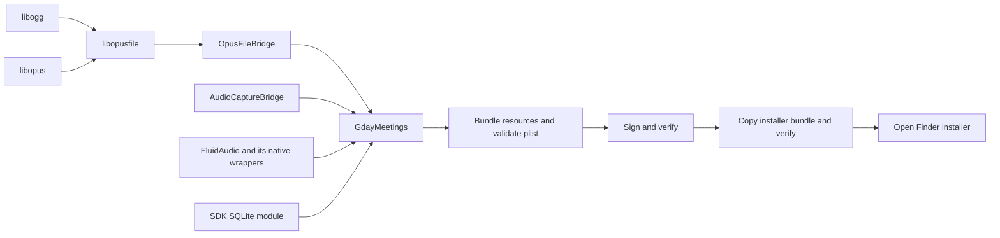

## Problem

Source installation felt slower as the Swift app grew. The user requested dependency analysis and parallelism only where it improves the build without changing runtime behavior.

## Dependency analysis

`install-macos` first builds the release app, then copies and verifies the installer staging bundle. The native libraries precede Swift compilation because their installed headers and static archives are inputs to OpusFileBridge. Within SwiftPM, independent targets are already scheduled by the build engine. The local Swift 6.4 toolchain defaults to 10 jobs; the verbose release command also passes `-num-threads 10` and `-whole-module-optimization` to the app compiler.

Release builds optimize the app as one Swift module. Much of that work cannot be split into independent file builds simply by raising the job count. See the official [Swift compiler performance guide](https://github.com/swiftlang/swift/blob/main/docs/CompilerPerformance.md) and [driver compilation model](https://github.com/swiftlang/swift/blob/main/docs/Driver.md). The checkout has 158 tracked Swift app source files. No-op builds reuse compiler outputs; editing one file can recompile the release module.

## Implemented solution

The native builder runs independent Ogg and Opus builds concurrently, splitting an active-CPU job budget between them. `GDAY_AUDIO_BUILD_JOBS` can limit the budget; 1 builds serially. Opusfile waits for both successful installs, then compiles its four independent C files within the same budget before archiving. Per-library logs stay in the native build directory and failure output includes their final lines.

Failure handling waits for both independent jobs before releasing the existing lock. A failed dependency prevents the dependent decoder and ready stamp. Compiler flags, pinned source checksums, deployment target, and Swift release optimization are unchanged.

## Measurements

Local isolated measurements on the same Mac and toolchain; these are individual runs, not a statistical performance guarantee. No other benchmark was run concurrently with the two clean native measurements.

| Work | Before | After |
| --- | ---: | ---: |
| Clean native libraries | 30.63 s | 14.86 s |
| Cached native dependency check | 0.07 s | 0.05 s |
| Unchanged release build and packaging | 2.75 s | 2.71 s |
| One-file app release rebuild | 148.84 s | Compiler behavior unchanged |

The clean native improvement is about 51%. This applies on first build or after native-script/compiler/SDK changes. Most edit-and-install cycles already reuse those libraries, so this does not claim a 51% improvement for routine installation.

## Reasoning

Parallelizing independent native dependencies removes a measured serial path. The small Ogg build receives one quarter of the budget, with at least one job; Opus receives the remainder. More Swift jobs would duplicate existing parallelism without addressing whole-module work. Disabling release optimization could change recording performance; splitting the app into modules requires a separate architectural change and is not justified by these measurements. Parallelizing tiny file copies or the cached 0.07-second dependency check would add coordination for little benefit. Signing and verification remain after their inputs are complete.

## Technical debt

None introduced. Whole-module app compilation remains the dominant changed-source cost. Module boundaries or compiler hot spots should be profiled before a larger build architecture change.

## Validation

`bash scripts/test-audio-build.sh` passed real one-job and four-job builds, cache reuse, invalid job counts, and injected checksum failure with sibling completion, lock cleanup, no decoder build, and no ready stamp. Bash syntax and diff whitespace checks passed. Final isolated `make build-macos` passed, including packaging and signing, in 161.64 seconds with a native rebuild and app recompilation; its subsequent unchanged build took 2.71 seconds. Benchmarks and builds use disposable paths; unrelated application edits and the installed app are untouched. Existing Command Line Tools linker search-path warnings and upstream Autoconf obsolete-flag probes remain. The upstream probes reject the obsolete flag; shipped compiler options do not add it. The missing search paths come from the local Command Line Tools environment; toolchain configuration should be repaired separately if they persist with an updated installation.
