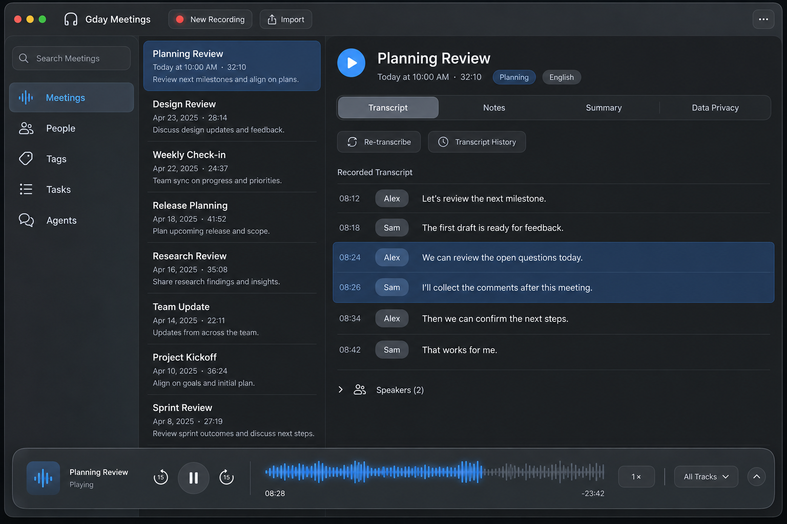

# Liquid Glass appearance refresh

## Problem and evidence

The current layout makes navigation, meeting selection, reading, and playback available together. Preserve that work. The supplied screenshots show a visually heavy sidebar, strong column boundaries, broad control backgrounds, and a full-width player attached to the window edge. A clicked content tab retains a rectangular focus outline. These details make the chrome compete with meeting content.

Reviewed the seven user-supplied screenshots: current app, App Store, Apple Music navigation and player, Infuse, and the tab focus state. They are visual evidence only; no private screenshot or meeting content is included in the repository. Smooth Apple Music scrolling is a user observation, not a benchmark or proof of its implementation. No running-app performance measurements were made for this proposal.

The existing [UI design guide](../../apps/client-macos-swift/docs/UI_DESIGN.md) already calls for Liquid Glass. This proposal makes that direction concrete without changing the information architecture. Source inspection confirms native table-backed meeting and transcript lists, a custom library shell, existing glass content tabs, and a macOS 14.2 deployment target.

## Proposed design

Use glass for navigation and persistent controls; keep reading surfaces quiet and opaque. Preserve all five destinations, the meeting list, the detail pane, the toolbar actions, and the player. Do not convert meetings to cards or an album grid.

| Area | Proposed appearance and behavior |
| --- | --- |
| Sidebar | An inset rounded navigation surface with a restrained native material. Place the library search input at the top, above Meetings, following the supplied App Store reference. Search retains its meeting/transcript scope across destinations; it does not silently become a People or Tasks filter. Use a soft neutral selected background and accent icon/text. Retain existing symbols, labels, collapse behavior, and accessible selected state. Size the field to the sidebar without widening it unnecessarily. Avoid adding a decorative outline when the native material already defines the edge. |
| Window toolbar | Keep the existing logo, title, sidebar toggle, recording, import, folder, and overflow actions. Remove the expanded search field from the toolbar. When the sidebar is collapsed, expose a search button that reveals it and focuses its search field; the existing search shortcut does the same. Preserve the query, results, and selection through collapse/expansion. Group related native controls with consistent spacing. Keep recording red and easy to find. Preserve active/inactive dimming and stable positions during sidebar transitions. |
| Meeting list | Keep dense reusable rows on an opaque surface. Use a quiet selection tint and lighter separators only where needed. Preserve date/duration, playback indicators, and the existing optional one-line summary title without leading heading markers. Do not increase row height for decoration. |
| Meeting detail | Preserve header, language, tags, and content order. Keep the title play button compact. Replace harsh boundaries with spacing or semantic separators. Use system typography; do not reduce transcript contrast to make the interface softer. |
| Content tabs | Retain Transcript, Notes, Summary, and Data Privacy in one compact rounded control. Selected fill communicates the active tab; a separate focus indicator appears for keyboard navigation. Avoid stacking a new glass surface over existing glass. |
| Processing controls | Keep re-transcription and transcript history adjacent to the transcript. Use native control sizing and hierarchy so these secondary actions do not dominate the page. Preserve provider names and explanatory source/status text when needed. |
| Player | Float one wide rounded material surface approximately 12 points inside the window edges. Span the window, including beneath the sidebar, to preserve waveform width. Retain title, playback state, skip controls, waveform, elapsed/remaining time, speed, and track selector. Keep at least the existing waveform width minus the small outer insets at the same window size. |
| Expanded tracks | Expand above the transport within the same player region. Keep microphone and system tracks aligned to one timeline, with existing mute and file actions. Recompute content clearance so the player never hides the last readable row or a focused control. |

The player belongs to the window shell and persists across Meetings, People, Tags, Tasks, and Agents. Navigation must not recreate the playback session or reset position. Clicking the playing title still locates its meeting. Task status remains independent and must not move transport controls on each update.

At narrow widths, truncate the player title first and move secondary actions into an accessible menu before reducing waveform space. Preserve all actions and existing minimum window usability. Exact breakpoints and native material shapes must be verified in Preview; the concept is not a pixel specification.

## Search in the sidebar

The search input stays at the top of the sidebar. Typing edits a draft query; it does not filter or replace the current screen. Pressing Return submits a nonblank trimmed query and opens a dedicated **Search Results** page in the main content area, replacing the meeting list and detail region while retaining the sidebar and persistent player. Do not create a second window or add a permanent sidebar destination for every search.

Show the submitted query, result count when known, and reusable result rows with meeting title, date, and relevant matching excerpts. Transcript matches include a timestamp. Keep draft and submitted queries separate: editing the field must not relabel old results as results for the new draft. A subsequent Return submits the new query, cancels or supersedes old work, and resets the results viewport. Clearing the draft alone does not discard the currently displayed results. Submitting an empty query performs no search.

Opening a result reveals its meeting and relevant content; a transcript result positions the matching passage without starting playback. Provide **Back to Search Results**, restoring the submitted query, selection, and viewport. Choosing a sidebar destination returns to normal navigation without stopping playback. Preserve the search session while navigating; a new submitted search replaces it.

Show **Searching…**, an empty-result message containing the submitted query, and a recoverable error with **Try Again** as distinct states. Page results from the index; do not load every transcript or scan files on the main thread. Keep keyboard focus predictable on submission, announce completion to VoiceOver, and support keyboard traversal/activation of results. Ensure the collapsed-sidebar search button and existing search shortcut reveal and focus the same field without submitting a query.

Validate Return submission from every destination, rapid successive searches with out-of-order completion, empty input, no matches, errors, result opening/back navigation, paging, and uninterrupted playback. Search results must meet the same large-library scrolling requirements as the meeting list. This is a proposed interaction change in addition to the appearance refresh; the generated meeting-screen concept does not demonstrate the results page.

## Pointer selection and keyboard focus

Clicking a tab selects it and leaves the selected fill, without a persistent keyboard focus border. Tab or Shift-Tab navigation restores a visible focus indicator; keyboard activation must work according to the chosen native control's semantics. Moving from keyboard navigation to a pointer click should remove the keyboard-only decoration without disrupting selection or editing.

Prefer native input-sensitive focus behavior. Reproduce the current custom button behavior before choosing an implementation. Do not apply unconditional `focusEffectDisabled`, remove keyboard focusability, clear the entire window's first responder, or install a global keyboard monitor merely to hide the ring. If local input tracking is necessary, scope it to the tab control and verify Full Keyboard Access and VoiceOver. Selection and accessibility focus must remain available regardless of the decorative ring.

## Smoothness is a release requirement

Retain native reusable table cells, stable identities, paging, and bounded prefetch. Do not replace the lists solely to achieve a visual style. Keep decoding, storage reads, summary extraction, and expensive text measurement off the scrolling path. Cache measurements by content and width, with bounded invalidation. Keep playback updates limited to the waveform and affected transcript rows.

Avoid glass, blur, shadows, or animated materials on individual meeting/transcript rows. Use a small number of stationary chrome surfaces. Group related custom glass effects with the supported native container where appropriate. Measure render cost before and after; an attractive still image does not establish smoothness.

Proposed acceptance targets, to be measured rather than claimed:

- Compare the same release build configuration, Mac, display refresh rate, window size, and scripted interactions before and after. Record cold and warm runs separately.
- Use synthetic libraries of 1,000 and 10,000 meetings and a long transcript with 10,000 segments, including overlapping sources. Exercise People, Tags, Tasks, Notes, and Summary with representative large fixtures too.
- Capture repeated 30-second scroll runs while idle, playing, and receiving synthetic live transcript updates. Target 95th-percentile frame time within the display budget (16.7 ms at 60 Hz; 8.3 ms at 120 Hz where supported), and investigate every UI stall exceeding 100 ms. Report missed-frame and hitch measurements, not average FPS alone.
- Require no regression in scroll hitch rate, first usable content, or navigation response against baseline. After repeated navigation/scroll cycles, retained memory must settle rather than grow with every visit. Record CPU, memory, and render traces alongside perceived responsiveness.
- Preserve viewport and selection during paging, tab switches, sidebar collapse, and player expansion. Check scrolling while scrubbing and while both audio sources highlight. Do not gain speed by dropping transcript updates or hiding content.

Use the existing [performance testing guide](../../apps/client-macos-swift/docs/PERFORMANCE_TESTING.md). Test actual playback separately from synthetic Preview before claiming end-to-end playback performance.

## Accessibility and compatibility

Respect light/dark/system appearance, inactive windows, Reduce Transparency, Reduce Motion, Increase Contrast, Full Keyboard Access, and VoiceOver. Use semantic colors and an opaque fallback when required. Recording, selected navigation, mute state, and overlapping playback must be distinguishable without color alone. Keep the established player hit targets and readable text sizes.

Keep macOS 14.2 support. Use current public native APIs with availability checks; older systems receive ordinary native materials and controls, not a custom simulation of Liquid Glass. Verify the shipping SDK and runtime availability during implementation. Do not change window architecture just to copy the App Store's traffic-light placement; preserve the current stable toolbar unless a native prototype proves equivalent behavior.

Apple references reviewed October 3, 2026:

- [Adopting Liquid Glass](https://developer.apple.com/documentation/technologyoverviews/adopting-liquid-glass): native components and system appearance preferences.
- [Applying Liquid Glass to custom views](https://developer.apple.com/documentation/swiftui/applying-liquid-glass-to-custom-views): custom effects and grouping for rendering performance.
- [Focus effect control](https://developer.apple.com/documentation/swiftui/view/focuseffectdisabled(_:)): controls focus decoration; it is not by itself an input-modality solution.

## Delivery sequence and validation

1. Capture the current isolated Preview in active/inactive, light/dark, pointer/keyboard states, plus scrolling baselines. Fix tab focus behavior as a small independently validated change.
2. Implement the sidebar search field and dedicated results flow, then prototype sidebar, toolbar, and dividers using native materials. Compare density, navigation, search, menus, window resizing, and sidebar transitions with the baseline.
3. Restyle the persistent player and expanded tracks. Verify every destination, seeking, keyboard controls, task status changes, small windows, and content clearance.
4. Run the accessibility and performance matrix, release build, relevant tests, formatting, and macOS CI. Keep or revise each effect based on the evidence.

Each implementation step needs before/after screenshots and accurate limits in its worklog. This proposal does not authorize performance claims based on visual review alone.

## Generated concept

Generated with the built-in image generation tool using synthetic content. The [generation prompt](../design/2026-10-03-liquid-glass-concept-prompt.md) is retained for revision.

Visual review: the image communicates the retained layout, wide floating transport, quiet selection, and simultaneous transcript highlights. It is illustrative, not implementation evidence. The revised image correctly places search above sidebar navigation. The generator changed the logo, enlarged the title play button, made the tabs rectangular, omitted some toolbar actions, and shaded reading surfaces more than intended. Retain the existing identity/actions, compact play button, capsule tabs, and flatter opaque reading surfaces during implementation. The waveform's generated proportions are illustrative; the width requirement above takes precedence. Light appearance, expanded tracks, accessibility, focus transitions, and scrolling are not demonstrated by this still image.

## Implemented solution and results

Created this proposal, a reproducible prompt, and a generated concept image. No application code or released behavior changed. Reviewed wording, synthetic content, asset references, and the scoped diff. A release build and UI tests are not applicable to this documentation-only change.

## Reasoning

Concentrating the refresh on chrome preserves the established reading workflow and dense lists. The broad floating player adopts the visual separation of a modern media transport while retaining the app's waveform advantage. Native materials and existing table reuse reduce the risk of introducing an expensive custom rendering system.

## Technical debt

None introduced by this proposal. The existing pointer focus issue remains unimplemented and is the first proposed delivery step. The planned older-system fallback is a compatibility requirement, not an added implementation in this task.
