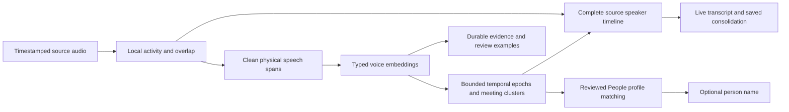

# Superseded design and retained evaluation

The user removed live diarization and retained-evidence consolidation in favor of post-recording **Speaker Diarization**. This worklog is historical: its architecture below describes the evaluated, now-removed observation pipeline, not current production behavior. The active design is [recorded-only speaker diarization](2026-10-08-recorded-only-speaker-labeling.md).

The final candidate improved many measurements but retained a known saturation fragmentation regression (9.496% versus7.984% original ownership confusion). Its source-frozen results remain in [RESULTS.md](../../experiments/observation-speaker-identity/RESULTS.md); no subsequent product rename or removal changes those measured outcomes. Dependent runtime and experiment drivers were deleted. Private source/binary/audio receipts remain under ignored `tmp/` for historical audit. The independently reproduced capture continuity fix remains relevant and is documented separately in [capture resampler continuity](2026-10-08-capture-resampler-continuity.md).

All following design sections are historical. They are retained to explain the experiments and their limitations, not to advertise supported live functionality or pending implementation work.

# Identity and evidence

A Nemotron channel is a temporary local track, not a meeting-wide person. Each capture source has its own streaming state and local generation. Meeting-wide anonymous acoustic identities are independent of those channels. A reviewed People association is a downstream optional name, and projection coordinates never participate in matching.

The journal retains generated embeddings with their actual physical source spans, compatible model/type metadata, local generation, observed activity, trust/publication bounds, omissions, and explicit gaps. Evidence persistence is separate from bounded live working state and from the few playable examples presented for review. Allocated identities do not establish speaker activity; all eight model slots exist before anyone speaks.

## Clean speech sampling

Ordinary sampling prefers a continuous three-second clean excerpt, with five-second spacing and unchanged posterior gates (.7 own activity, less than .2 competing activity). Short turns can contribute completed 300 ms–3 s fragments from one source, local label, and trusted generation. The accumulator requires at least two seconds of actual speech and is bounded by eight spans, six seconds of PCM, and a thirty-second acoustic envelope. It resets at capacity, gaps, and generation boundaries; ordinary samples consume overlapping buffered support so PCM is not counted twice.

Multi-span samples retain each physical span. Their enclosing interval is not treated as sampled audio. Overlap constraints, direct timeline support, quality checks, and playback all use the physical union. Concatenated playback trims converter priming and ends at the exact support boundary. This improves short-turn coverage but does not guarantee that a local label never mixed two real speakers; one such development sample remains included in evaluation.

## Streaming capacity and handoff

Capacity is established from credible speech runs (at least 300 ms per run and three cumulative seconds), not allocated IDs. When all eight channels are established, rollover is requested at a nearby suitable boundary. The loaded model is reused; streaming state/cache reset and a twelve-second recent suffix initialize the next state. Recording and transcription continue. Old and new publications are divided by one handoff timestamp, and bootstrap history is not published twice.

A saturated-bootstrap guard prevents repeated resets that fail to create headroom. Its forty-five-second retirement rule is not a universal minimum rollover interval. Actual spacing and replay work must be measured, rather than inferred from that guard. Fresh generations reassociate through embeddings; equal slot numbers cannot inherit names. Experimental bootstrap identity queries were excluded because they added no measured development timeline benefit and introduced additional persistence/parity obligations.

## Acoustic identity reducer

Each trusted local track maintains a bounded rolling epoch prototype. Current selected parameters are global similarity .65, runner-up margin .04, change similarity .45, contrary-pair coherence .55, and twelve retained representatives. Compatible model types are required. Competing candidates contribute to the margin even when below admission threshold; observed simultaneous distinct voices constrain merging.

One divergent observation is provisional. It can preserve anonymous continuity while withholding People naming and prototype training. Two mutually coherent divergent observations start a new epoch from the first contrary observation. A decisive compatible match to an already known global voice can recognize a return without waiting for an invented new person. Neither path aliases the entire historical local-channel lifetime to the new voice. Ambiguous observations may be reconsidered when later evidence arrives. Cluster aliases redirect constraints and are emitted deterministically.

Local silence alone does not expire an established voice. Explicit gaps, contradictory observations, generation changes, and capacity trust bounds do interrupt continuity. After capacity, a clean observation remains eligible as independent acoustic evidence, but it does not restore indefinite trust in the old channel.

# Timeline publication and saved reconstruction

The live adapter consumes recorded callback availability order, keeps a thirty-second mutable publication tail, and seals older intervals. Physical evidence/constraints are retained for sixty seconds: thirty seconds of possible sample envelope plus up to thirty seconds of admitted arrival lag. This retention differs deliberately from the visible correction horizon. Evidence too old to use safely is audited as ignored-expired and removed as a projection anchor; its durable journal entry remains. It does not become a false contrary-voice boundary.

The complete observed timeline remains present, including provisional and unresolved activity. Identity aliases are persisted application metadata, not scorer-only relabeling. Evaluation reports both the raw frozen publication and the settled view displayed through those aliases.

Live and saved reconstruction share one indexed exclusive-activity sweep. After capacity, accepted nonprovisional evidence can support its connected exclusive local run within thirty acoustic seconds of physical support. Extension stops at missing activity, overlap, contradictory evidence, gaps, and window boundaries. It does not bridge the empty envelope between disjoint fragments. Saved consolidation can use later evidence and is therefore evaluated separately from causal live publication.

The post-meeting pass clusters retained compatible evidence and reconstructs speaker assignments with the activity timeline. If changed acoustic membership requires different labels, it creates evidence-bound identities rather than inheriting a name from an old channel number. It preserves historical/manual assignments at their recorded scope. Existing whole-label corrections remain whole-label corrections; they are not silently reinterpreted as exact-audio annotations.

# People association and review experience

Anonymous diarization works with an empty People library. Library profiles help name voices and cover differing microphones/conditions; they do not establish the number of speakers or repair mixed speech by themselves. Profiles keep bounded, quality/diversity-selected representatives, while the evidence journal preserves generated observations for later consolidation. The latest three examples are not the sole acoustic record.

The Speakers panel is an association surface: actionable labels require compatible embedding evidence and playable support. Labels without evidence do not invite a meaningless person association. Uncertain assignments suppress inherited person names and voice examples until supported or explicitly reviewed. This suppression survives persistence, aliases, recovery, and transcript projection.

User changes serialize with capture commits. Exact reviewed excerpts are applied only to covered passages, unrelated uncertain rows remain unnamed, and undo restores the prior review state. Stable selection watermarks distinguish explicit review from names propagated later by the machine. A completed durable write is adopted even when its initiating task was canceled. No stale preparation may overwrite a newer review or profile dependency.

# Persistence, compatibility, and runtime

Vector hydration, transaction preparation, and atomic capture writes run off the main actor. The canonical library writer validates read dependencies even if an unchanged write was optimized away. Reviewed profile work is shared and dependency-invalidated; at most two cold profile builds run concurrently. Incremental diversity selection is tested against the original calculation.

Transcript attribution uses source-aware interval indexes and bounded active data instead of repeatedly scanning all allocated identities. Retired vectors are compacted without losing durable evidence. Gap reporting, overload recovery, startup/label-toggle behavior, and stopped-session callbacks have focused coverage. Capture processing gaps are not automatically evidence that recorded audio is missing.

Old single-span evidence remains readable. New multi-span journal/sample representations use explicit versioned fields so an older reader cannot reinterpret a disjoint envelope as one continuous voice example. Typed embedding compatibility is retained across serialization. The saved omission audit round-trips, unknown provenance remains untrusted, and historical capacity revisions use their own recorded bounds rather than fabricated new metadata.

A separate route-change bug caused a reset storm independent of capacity: after a microphone format change, the writer compared input timestamps with delayed resampler output. Artificial short gaps repeatedly reset labeling. The correction advances accepted input time separately, drains only accepted delayed PCM at real boundaries, rejects duplicate/overlapping input correctly, and preserves mute safety. AGC settings remain unchanged. This is not a reason to loosen gap detection or disable gain control; see the separate capture worklog.

# Validation and measured limits

All execution binds source, binary, model assets, input audio, configuration, and outputs. Frontend inference, actual adapter publication, and standalone saved consolidation have separate receipts. Callback clocks represent submitted-audio availability upper bounds, not concurrent capture latency. Reference mappings are fitted once per complete recording, not separately per owner or favorable excerpt.

| Frozen v12 confirmatory scenario | Original source-ownership confusion | Candidate |
| --- | ---: | ---: |
| Arrivals and returns | 35.834% | 2.250% |
| Short turns | 23.697% | 23.697% |
| Saturated rearming | 48.568% | 16.926% |
| Six speakers with overlap | 0.000% | 0.000% |

These synthetic ownership metrics are not human DER. Arrivals coverage changes 87.050%→86.975% (0.12 s less), while merge precision and split recall improve. Saturation coverage, merge precision, and split recall improve. The development short-turn tradeoff remains: higher coverage/merge precision but lower split recall. Five previously examined fresh private controls preserve or improve reviewed random DER: J25.593%, B15.965%, D97.759%, G19.887%, C19.406%. DER can exceed 100% when extra speaker-time is large. Targeted excerpts remain separate from random review. Saved worker output is silver; it is not accepted as human truth, and the worker remains stronger on some reviewed recordings.

The bounded snapshot passed 80 focused tests across fourteen suites, and forty Python harness tests passed. Earlier full/targeted app checks are not substituted for the final integrated release run. Four additional full real meetings have no human truth; their source coverage, uncertainty, transitions, saved-provider disagreement, and listenable examples support review rather than an accuracy claim.

Runtime evidence includes a 150-reset actual-stream comparison with identical final phrase snapshots: main-thread CPU 17.996→.881 s, last-quarter callback p95 82.422→2.418 ms. The earlier oversized benchmark timed out and remains retained. A native transcript stress probe under concurrent CoreML load measured layout p95 4.56/7.81 ms for 1k/10k rows, with one 125.78 ms hitch; it does not measure presented frame rate. Earlier two-hour/8,000-example persistence replay reduced wall time 231.9→72.4 s and maximum main-actor heartbeat gap 1,250→223 ms; this excludes acoustic inference/UI. All workload limits and failed attempts remain in RESULTS.md/private receipts.

# Disposition

The live observation and retained-evidence consolidation features were removed at the user's request. Their model-capacity/state management, streaming callbacks, automatic readiness and dependent runners are no longer product features. The replacement performs Community-1 Speaker Diarization on saved recording audio and defaults to local processing; it requires its own integrated release validation.

Historical comparisons, failed hypotheses, known fragmentation and runtime measurements remain in [RESULTS.md](../../experiments/observation-speaker-identity/RESULTS.md). They must not be presented as validation of the replacement architecture. The requested alternative segmentation comparison was not run. Private audio, receipts and review examples remain under ignored `tmp/`.
